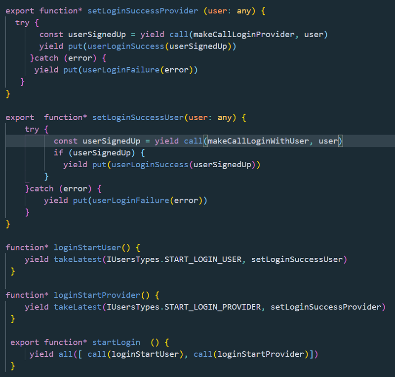
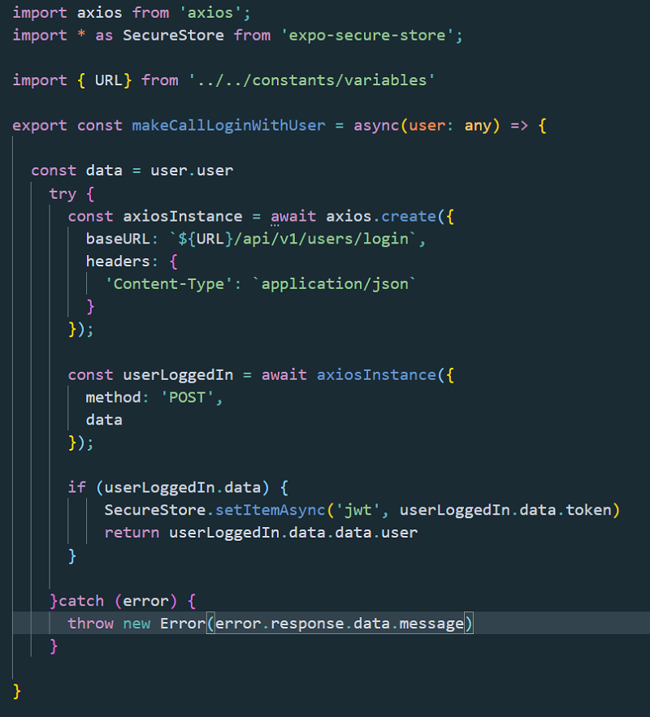
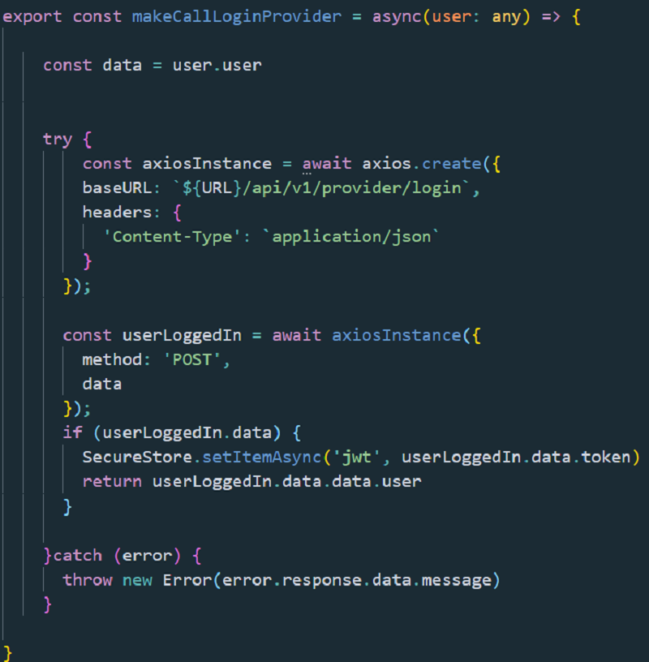

#A Saga dilemma

I have encountered a little problem when building an app with React Native and my own back-end made with Express and MongoDb.

Don’t ask me why, but I needed 2 models for 2 types of users.

They are totally different between each other, so separate them in a traditional way by “roles”, felt like making no sense to me.

So I decided to go with 2 models, one for every type of users.

But as you may already be thinking, some small problem arises, especially with the authentication for both of them.

You know, to keep a user logged in, you get its jwt token, save it to some secure storage in your app (in my case was the secure store provided by Expo), and send the token with a first request whenever the app first starts and wait for the response. And with every request that needs authentication.

The response will be the user object.

In this case the response is handled by an endpoint which takes the token, decodes it and extracts the id from it.

Then searches the database for that specific user and returns the user object to our front-end. To my React Native app in my case.

But here my problem arises: What if I had 2 models for users? (Because of my particular case - don’t ask why)?.

How would possible the endpoint function handler in Express will know where to look in database for a user? In which model?

Well, that is pretty obvious: I pass a “model” to the handler in an higher order function and when I call the handler from one or another user endpoints I pass that model to it as a string. Letting the handler manage which model to search in the database.

But again, in front-end I only have the token! I don’t have the user id, name or email. Anything but the token.

I don't know which model the token owner belongs to!

So I have to send the token to back-end and let it deal with the models to find out where to look for it in database.

Here’s the solution I came up with, using Redux Saga.

Disclaimer: I don’t know if it is a good solution, I am not a coder guru! Yet!!!☺️☺️☺️

I only know it works for me and I want to share it with you! Maybe there is a better solution than this, I can admit it!

I need two Axios calls (I use Axios to make the APi call btw).

One with a route for one model another one with another route for the other model.

Note: It would be probably a simpler approach to use Promise.all and wait for both API calls to resolve 8or reject). So this is just in case you use Saga!

I initiate the Saga with a two generic action: “loginStartUser” or "loginStartProvider.

Here is the code for Saga:

Then, I dispatch an action when the user logs in, and another one when the user called "provider" logs in as well.

I make my first call to the first endpoint from the saga "setSuccessLoginUser" or "setSuccessLoginProvider", depends which one of the two actions are dispatched.

I switch between the two users when I dispatch the action start.

Any action dispatched take its own route and resolves or rejects respectivly.

In this way I allow either to the first Saga function to come back with some result, and if there in any I go for the second saga function.

Here are the two api calls functions:!

It works like a charm, confirming me what I already knew very well: Redux Saga is amazing!

No side effects, totally independent from React code, running on its own, asynchronously!

PS: Please don't yell on me because I have the user set to any; I still have to figure out its type.

There are 2 kind of users, very diffrent from each other.

Probably an intersection would work in an interface. I still have to see that part!
