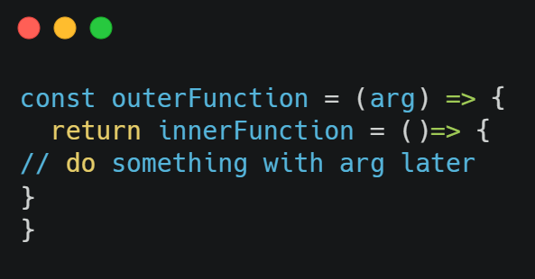
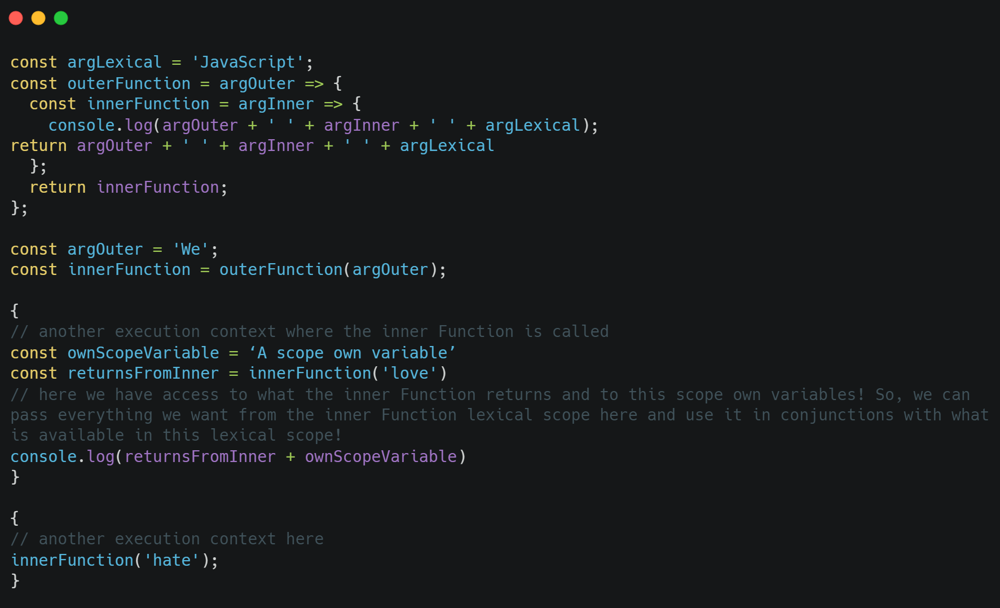
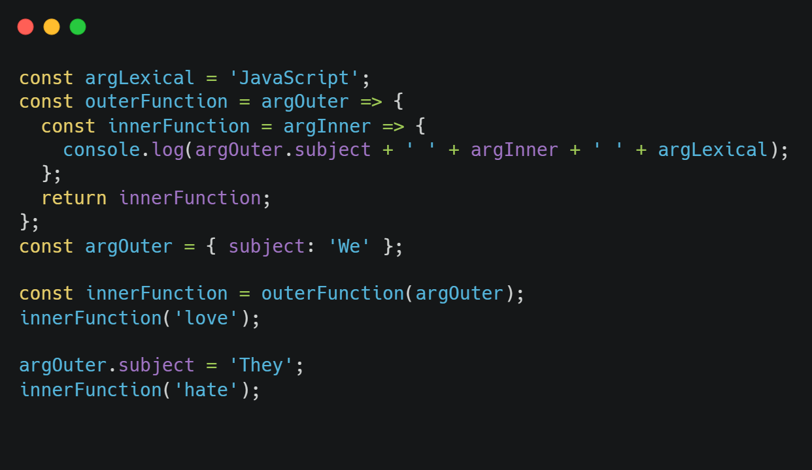

 
#What are Closures in JavaScript?
 

##I know, I know, what you think:

“This is another random article about closures from someone who I don’t know and I am 100% sure I won’t know what closures are if I read it! Is it worth to read?”

I know that because is exactly what I am telling myself when I saw an article about closures!

But here is a deal between me, the author of this article and you, the unknown (to me) reader:

If after you read this article, you still don’t know what closures are, you send me a post written for LinkedIn where you say everything you want about me a to bogdan4adrian4tech@gmail.com and I promise I will post it on my LinkedIn wall! (No hard offences)

##Do you agree?

I was there! I couldn’t understand closures for quite some time (same with “this” keyword). Well, to be precise, I understood them theoretically but it was hard to recognize them or to use them consciously in practice!
When I first learned about closures, the online teacher told me that, it will take some time to understand them well.

##Turns out that he was right!

It took me a lot of time to be honest and a lot of inconclusive articles to read until I was able to figure it out, by myself, what closures really are!

You see, most of the article about closures are written by developers with much experience. They explain them to you, at their level. But you might be a beginner!

Everything they say about closures (This is true about many other JavaScript complex topics), is form a higher-level view of how JavaScript behaves.

But not all of us have that knowledge which can allow us to follow the reasoning of that experienced developer!
Even the terminology is hard to grasp somehow!

##Yes, closures are a very important JavaScript topic!

We all use them as a matter of fact! More, we use them long before we understand them!

But understanding closures set us free as JavaScript developers!

Closures like the keyword “this” or the understating of how JIT - just in time compiler – works etc., is knowledge which set a JavaScript developer a part, making him a “senior” developer!

But enough talk, let’s see how and if I can explain closures to you! I don’t want a random post insulting me on my LinkedIn wall LOL!

#First thing first!

Before throwing any bit of code on the screen, we must understand what are closures good at?

When and why, can we use them?

When you read those professionals, articles explaining closures, all of the answer to this question is given in a code format.

Which makes it very confusing if we can’t read yet the code with the JavaScript engine’s eye.

We just can’t sometime figure out in the piece of code we see on the screen what the author intended to show us.

Because maybe we do not have enough experience, because we miss some fundamental understanding of other JavaScript concepts like scope, or execution context etc.

##Here we go: Closures serve the fundamental scope of storing some data in a native way (I mean in the code).
That’s it!

Is a minimal data storage capability we have inside our code to save some data then use it later – after the first execution finishes!

How can we achieve that with closures?

##Let see some code now!

Here we have a closure.!

 

Basically, it is just a function wrapping another function!

Side Note: This is the simplest example. However, in practice the 2 nested functions can be more complex, with more arguments each one can receive and more logic going on inside each of them or just many more functions nested inside each other!

We know JavaScript is a single thread execution programming language.

Which means it can only do 1 thing at the time.

Therefore, in the bit of code above, JavaScript engine will first execute the outer Function.

The inner Function is not executed at the same time!

The inner Function is just what the outer Function returns, and it is still a function until it will be called later!

##This is so important to understand!

The inner Function will be executed when it will be called separately, later!

This may happen right next line or 100 lines further down when we call the outer Function!

But not at the same time!

So, if JavaScript is a single thread execution programming language, that means it executes the outer Function only at the one given time when it is called somewhere!

After the execution the outer Function this one is popped out of the execution stack!

The outer Function is gone, is no longer there after it executes!

But wait, if the outer Function executes and then disappears, what happened to the inner Function?
What happens to the arg it was carrying on?

Well, the inner Function sits there in the complied frame and waits to be called!

When the inner Function is called, it executes.

But wait gain, it needs the arg from the outer Function!

Where does the inner Function gets the arg from if the outer Function is gone and it does not exist anymore?

The arg is still there!

Even though the outer Function is gone, the arg is there available for the inner Function!

The arg has been saved for us by the JavaScript engine when the outer Function executed – in the past!
Here the notion of time is important, even if we speak in microseconds!

##There is something more interesting going on here!

If the inner Function will be called later, maybe more than once, the arg will be available for it no matter how many times the inner Function is called.

Until the last call, when the arg gets garbage collected!

Now you can see how we “store data” inside the code, I hope!

If arg is the data, the outer Function is our storage capability!

The inner Function is the code consuming it!

However, things are more complex than I was storytelling you here!

There are other things which we have to consider!

##Let me try to explain a bit more!

In JavaScript, whenever we call a function a new execution context is created around that call.

The new execution context gets the keyword “this”.
That execution context might have its own variables available.
So, the inner Function can be executed in a different execution context and implicit in another lexical scope than the one where is declared and where the lexical scope is different!

##That is a closure!

So, when we call the inner Function somewhere else, the execution context of the inner Function might be different than the one the outer Function was called in.

That means the keyword “this” will be different and calling the inner Function still works giving it access to all its own lexical scope!

That means we can pass those variables to the inner Function.

If the execution context of outer Function is different than the execution context of the inner Function, we can say that we have 2 worlds here!

In that execution context where the inner Function is called, we can have now available whatever the inner Function returns!

##Can we see the power of that?

Let see some code:

 

If we pay attention to the argOuter, we’ll see it exists also by the time he inner Function with ‘love’ arg is called, and also when inner Function with arg ‘hate’ is called!

But the outer Function is called couple of lines before in another execution context yet!!

The outer Function executes and is popped out of the execution stack!

The argOuter however is still there for the next 2 calls of the inner Function and it will be there even there will be thousands calls of inner Function!

We cannot change the outer Arg variable declared inside each execution context because the closure will preserve the variable it was called with at the moment the outer Function was called!

We should call the outer Function again in that execution context with a new outer Arg if we want to do that, but that means the closure is reset!

So, if the variable declaration points to a primitive data, the arg does not change exactly because of the closure!

##This may lead us to face sometimes a problem, which is called “stale closure!”.

What if we need the closure to change the outer Arg when in every execution context we call the inner Function without calling the outer Function again with a new outer Arg?

In that case we will have to switch the data type from a primitive to an object! Passed by reference instead of passed by value!

In this case the arg in the outer Function will be always the same, but now we can modify it by modifying the object internally (its proprieties).

So, no matter when the outer Function is called with that outer Arg object because we can modify the data the object contains leaving the identity of the object unchanged!

And this is strict related to the topic of immutability that we have in JavaScript!

 

##Again, this the power of closures!

We call a wrapper function just once passing it some arguments, and then we will have an inner returning function accessing those args how many times we want, wherever we call that inner Function!

And no matter the outer function executes and is gone away by the time the inner Function is called!
The args will still be there, available!

##Let us see a practical example and how closures work with a real scenario!

Note: I am not a content creator with lot of experience, so please forgive me for the quality of this video!

 
 

<iframe width="530" height="312" src="https://www.youtube.com/embed/3iTBKXkfUxg" title="YouTube video player" frameborder="0" allow="accelerometer; autoplay; clipboard-write; encrypted-media; gyroscope; picture-in-picture" allowfullscreen></iframe>

Github Repo ot this dummy app if you want to play around: https://github.com/bogadrian/clousers
