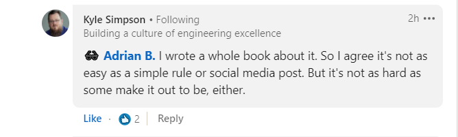

 

<h1>This post was inspired by Kyle Simpson Advanced JavaScript course which I followed on Pluralsight.</h1>

This post tries to simplify a bit his explanation about the keyword “this”.

I never understood well the keyword “this” before watching Kyle's course!

If you really want to learn in depth about the keyword “this”, then I am advising you drop this article and go to You don’t know JavaScript by Kyle Simpson!

<a href="https://github.com/getify/You-Dont-Know-JS/tree/1st-ed/" target=_blank>You don’t know JavaScript by Kyle Simpson!</a>

How Kyle Simpson himself said in a Linkedin post that I wrote:

Then he gave me the link to his <a href="https://github.com/getify/You-Dont-Know-JS/tree/1st-ed/this%20%26%20object%20prototypes#you-dont-know-js-this--object-prototypes---1st-edition" target=_blank>You don’t know JavaScript book “this” keyword chapter!</a>

I read all of that!

It is a wonderful material which explains in depth how the keyword “this” works in JavaScript (among other concepts).

But if you are a beginner who hardly understand things like Lexical Scope, Scope Chain or Hoisting, I bet you won’t know much about the keyword “this” after reading Kyle’s book!

In order to be able to grasp his in-depth explanation, you’ll have to know already a lot of JavaScript!

So, let me try please to enlight you a bit more!

In the worse scenario you will learn nothing!

However, I hope you will learn something!

<h1>Why the keyword “this”? What is it good at?</h1>

Simply put, the keyword “this” allow us to have a reference to the object that "owns" the function!

Well, it allows us to get a reference to the function execution context but let’s keep it simple, let’s say only to an object that calls the function!

<strong><em>In other words the object container where the function executes!</em></strong>

Remember, the execution context is not the same with the scope!

Please make sure you understand well what the execution context is first!

The object that “owns” the function may be the window object or an object declared by us and it can dynamically be changed at the run time.

If the owner of a function is dynamically changed, the keyword “this” allow us to refer to the changed owner object!

Confusing? I know!

<strong>Think about it in this way:</strong>

<em>If&nbsp;a&nbsp;function&nbsp;were&nbsp;a&nbsp;soccer&nbsp;ball,&nbsp;it&nbsp;is&nbsp;like&nbsp;you&nbsp;are&nbsp;throwing&nbsp;that&nbsp;soccer&nbsp;ball&nbsp;in&nbsp;the&nbsp;water!</em>

<em> The&nbsp;surrounding&nbsp;environment&nbsp;of&nbsp;the&nbsp;ball&nbsp;will&nbsp;be&nbsp;the&nbsp;water,&nbsp;but&nbsp;inside&nbsp;the&nbsp;ball,&nbsp;there&nbsp;will&nbsp;still&nbsp;be&nbsp;air!</em>

<em> It&nbsp;was&nbsp;put&nbsp;inside&nbsp;it&nbsp;by&nbsp;a&nbsp;compressor&nbsp;somewhere&nbsp;else.</em>

<em> Think&nbsp;at&nbsp;the&nbsp;keyword&nbsp;&ldquo;this&rdquo;&nbsp;like&nbsp;it&nbsp;was&nbsp;the&nbsp;air&nbsp;inside&nbsp;the&nbsp;ball!</em>

<em> Theoretically,&nbsp;analyzing&nbsp;the&nbsp;air&nbsp;we&nbsp;can&nbsp;say&nbsp;a&nbsp;lot&nbsp;about&nbsp;the&nbsp;compressor&nbsp;which&nbsp;put&nbsp;that&nbsp;air&nbsp;in&nbsp;the&nbsp;ball!&nbsp;(The&nbsp;execution&nbsp;context&nbsp;of&nbsp;the&nbsp;air).</em>

<em> When&nbsp;we&nbsp;call&nbsp;&ldquo;this.tube&rdquo;&nbsp;-&nbsp;sudo&nbsp;code&nbsp;here&nbsp;-&nbsp;we&nbsp;will&nbsp;have&nbsp;access&nbsp;to&nbsp;the&nbsp;tube&nbsp;that&nbsp;the&nbsp;compressor&nbsp;used&nbsp;to&nbsp;inflate&nbsp;out&nbsp;ball!</em>

<em> There&nbsp;is&nbsp;no&nbsp;way&nbsp;to&nbsp;pass&nbsp;the&nbsp;water&nbsp;inside&nbsp;the&nbsp;ball&nbsp;when&nbsp;the&nbsp;ball&nbsp;is&nbsp;in&nbsp;the&nbsp;water,&nbsp;only&nbsp;if&nbsp;you&nbsp;prick&nbsp;the&nbsp;ball!</em>

That means explicit binding but that is something different!

Is this metaphor hard to understand?

Take a look at this code:

    function myFunction() {
        console.log(this);
        console.log(this.bar);
    };

    const firstOwner = {
        bar: 'bar1',
        myFunction
    };

    const secondOwner = {
        bar: 'bar2',
        myFunction
    };

    const bar = 'bar0';

    firstOwner.myFunction(); // this keyword will be the firstOwner object
    secondOwner.myFunction(); // this keyword will be the secondOwner object
    myFunction(); // this keyord is the window object

 

If you really want to understand how the keyword “this” works in JavaScript, first you’ll have to grasp other concepts and definitions!

<h2>The most important ones are the Execution Context and the Scope and Scope Chain.</h2>

There are JavaScript developers who will need years before grasping the mechanism behind the keyword “this”.

It took me years indeed and the desire to know!

<em>Warning: When you are a beginner don’t try too hard to understand the keyword “this” as it will be very hard for you. Because you might not have a full picture of everything what is going one inside the code when the JavaScript parser goes trough it. I promise you’ll understand it in time!</em>

More, there are JavaScript developers with many years of experience behind, working as such, who will never know 100% how the keyword “this” really works behind the scene!

I made an experiment which you can repeat right now: Go to YouTube and search for “JavaScript keyword this”.

Watch all the videos you find on the first page. Those are the most relevant anyway.

After you watched them, you will know this:

- The mechanism of the keyword “this” when a function is used inside an object or a class as a method!

- You will know the difference between the arrow function and regular function when it comes to the keyword “this”!

- You will learn how to know what the keyword “this” of a function will be by looking where the function is called or who is calling the function!

That’s all you’ll learn from those first YouTube page about the keyword “this”!

Well, to be honest that’s all you need to know about the keyword “this” if you are not interested on how its mechanism really works!

You’ll be good to go with that knowledge in, let’s say 99% of the cases where you’ll use the keyword “this”.

Not too many anyway, because functional JavaScript is taking over OOP JavaScript lately.

In Functional Programming there are very few the cases you use the keyword “this”.

Still, you’ll need the keyword “this” in some edge case when working directly with the DOM for example.

So, you have to know that, there is more than those YouTube videos teaches you!

There are scenarios when the keyword “this” are not derived from an object or class method directly.

Or at least not form a method we can see and analyze with open eyes!

It comes from somewhere down in the code base and it suffers many transformations, maybe, before the function gets executed and the keyword “this” is set.

<h1>The principles of the keyword “this”.</h1>

The keyword “this” can be determined in 4 ways!

1: Default binding - applies when the function looks like being called by nobody. Then the default caller will be the window/global.

    myFunction()

 

2: Implicit binding – when a function is called like a propriety of an object other than the window object. If there is an implicit biding, this will apply instead of the default binding!

    const obj = {
      myFunction
    }

    obj.myFunction()

 

3: Explicit binding – when you call the function with “call”, “apply” or “bind” functions native methods and so you set the “this” keyword to whatever object you want it to be set. myFunction.call(anObject) // this in myFunction will be anObject in this case.

    function myFunction() {
      console.log(this);
    }

    const obj = {
     a: 'bar'
    };

    myFunction.call(obj); // call
    myFunction.apply([obj]); // apply

    const laterCallOfMyFunction = myFunction.bind(obj); // bind

    laterCallOfMyFunction();

 

4: Hard binding – this happens when you bind the keyword “this” to an object you want the function to be bound and you use that function from there down with that particular hard binding! For this use case I invite you to take a look at Kyle Simpson's book who explained it much better and in depth.

    function myFunction() {
     console.log(this);
    }

    const obj = {
      a: 'bar'
    };

    const bindFunction = function () {
     myFunction.call(obj);
    };

    bindFunction(); // bindFunction will have “this” keyword hardly bind to "obj" from this line down!

 

<h1>We will be mostly talking about the default binding and the implicit binding here.</h1>

These is the most confusing part of the keyword “this”.

Once you can determine what will be the keyword “this” of a function by telling if it is a default or an implicit binding, you will be able to change that easily using the explicit binding or the hard binding!

One thing you have to understand straightforward is that the keyword “this” is dynamically determined and is not the same with the scope where the function is called.

As long as you will look for “this” keyword in the scope of that function, you won’t be able to understand it!

More, the keyword “this” is NEVER intersecting the scope of the function being called, except for the case the keyword “this” is the global window!

Let me explain!

    // this.alert(
    // 'I am in the scope of myFunction because I belong to the window object. If you comment me out here and call me inside myFunction I will work the same! So, I can be used inside myFunction with the window object as the owner'
    // );

    function myFunction() {
        console.log(this.alert === window.alert);
            this.alert(
            'I am in the scope of myFunction because I belong to the window object. If you comment me out here and call me outside myFunction I will work the same! So I can be used inside myFunction with the window object as owner'
        );
    }

    myFunction();

 

If we have a scope created by some curly braces, as in the code example below the function getting called inside that scope does not take the keyword this from that scope!

In the example below myFunction is called from someFunction.

“This” of someFunction is “obj” because it is called as method of "obj".
We know that form those YouTube videos, right?.

But “this” of myFunction is the window anyway.

Why?

Because where I call myFunction inside someFunction, the “this” keyword does not get passed through!

The “this” keyword of someFunction is in its scope, as I was saying before.

The scope is not the same with the keyword “this”!

Well, I know you are already confused.

I try my best to demystify all of this!

    function myFunction() {
       console.log(this); // window
    }

    function someFunction() {
        console.log(this); // obj
        myFunction();
    }

    const obj = {
        bar: 'a',
        someFunction
    };

    obj.someFunction();

 

<h1>To understand the mechanism of the keyword “this”, we have to understand first how JavaScript “passed by reference” mechanism works!</h1>

A function is an object in JavaScript, we all know that.

So, a function can only be passed by reference!

That means, the function is declared, or write if you want, only once and it is stored by JavaScript engine in the Heap when the code gets compiled.

There can’t exist 2 function with the same identity!

Whenever we call the function, we call the same function every single time.

Not a new different function but the same!

A function is somehow “owned” in JavaScript!

I use “owned” here in a metaphoric sense!

<strong><em>This is so important to understand!</em></strong>

A function can’t exist by itself! It has to be owned by some object!

The most obvious owner of a function is the global window!

When we declare a function as top level code, no matter a function expression a function declaration or an arrow function, the owner of that function is the Window. (in browser, in Node is the Global).

Even an IIFE is owned! It is owned by the window object! That happens by default binding!

When a function is called by nothing but itself, as in the case of an IIFE, the keyword “this” defaults to the window!

An IIFE will always be owned by the window object as it calls itself.

It can’t never be called as a propriety of an object declared by us.

It can be assigned to a variable but that will be its returns, not the function itself.

    console.log(
        (function() {
        console.log(this) // window/
        })()
    );

Or

    const returnFromIIIFE = (function () {
     return 10;
    })();

    console.log(returnFromIIIFE);

 

JavaScript syntax allow us to call functions without attaching the window object before.

But if you call window.myFunction() or this.myFunction() it will work the same.

<strong><em>Which proves us the function is owned by the window object!</em></strong>

    function myFunction() {
     console.log(this);
    }

    this.myFunction(); // it works, this is the window
    window.myFunction(); // it works here too

 

So, when we have someFunction calling myFunction in its inner scope, the owner of myFunction is still the window!

This because myFunction is referenced by the window no matter it is called inside the scope of someFunction.

If we want myFunction to be referenced by something different than the window, we will have to twist our syntax to allow us to call myFunction with something else, example: obj.myFunction().

In such a case, the obj will be the owner of myFunction, or better, myFunction is referenced by obj!

The main take away from what I wrote so far is this:

<strong><em>A function must be “owned” by someone, it can’t exist alone.</em></strong>

<strong><em>Who owns the function is a reference to that function.</em></strong>

T<strong><em>he owner of the function sets the “this” keyword for the function.</em></strong>

Think at an owner of a function as something that gets the definition “this” and it is passed in the arguments of the function, to be available inside the function!

    function myFunction(/_ "this" is passed here and it is the obj or the window, depends on who owns the function. It can't be seen here but it is available inside the body of the function_/) {
        console.log(this);
    }

    const obj = {
     myFunction
    };

    obj.myFunction(); // the "this" keyword in the function arguments is the obj
    myFunction(); // the "this" keyword in the function arguments is the window

 

If we want to draw a conclusion from this, I would say we need to look not WHERE a function is called, but HOW a function is called.

Well, we need to look at where a function is called because otherwise, we can’t see who is calling it. But not the WHERE sets the “this” keyword. The WHO!

Who is its owner? Is it the window object? Is it another object? It has to be an object; a function can’t exist by itself!

Once we answer this question we determined “this” keyword of that function!

In the code below the owner of myFunction is “obj” and not someFunction:

    function someFunction() {
        const obj = {
            a: 'bar',
            myFunction() {
            console.log(this) // obj
            }
        };
        return obj;
    }

    const owner = someFunction();
    owner.myFunction();

 

With all what we know so far, let me ask you a question: <em>When looking at the code below we see myFunction is called inside a method of obj. What is the keyword “this” of myFunction?</em>

Do you think is obj because myFunction is called inside of one its methods or is it the window because myFunction does not look like being owned by obj even though it is called inside of one its methods?

    function myFunction() {
    console.log(this);

}

    const obj = {
        a: 'bar',
        someFunction() {
        myFunction();
        }
    };

    obj.someFunction();

 

If you answer the window, you are right!

MyFunction gets the window keyword “this” because its owner is the window!

There is no reference to myFunction inside the obj!

No matter myFunction is called in a method of obj called someFunction, its owner is still the window!

The owner of someFunction is obj, so the scope where myFunction is called and its execution context gets the “this” keyword of obj! But not myFunction itself!

    function myFunction() {
        console.log(this); // window
    }

    const obj = {
        a: 'bar',
        someFunction() {
        console.log(this); // obj

            // myFunction owner is not the obj! It is not one of its proprieties here! The owner of myFunction is the window object!
            myFunction();

        }
    };

    obj.someFunction();

 

Here it is how you need to think: <em>the “this” keyword inside of a function is not given by its scope but by its execution context, which happens to contains the owner of that function as well, along with all the variables declared inside that owner, or the execution context if we want to stay official in our definitions.</em>

Think at the owner as a container delimited by curly braces where the function executes! Attention, the function executes not is called!

Where the function is called is a different thing and that has to do with the scope not the execution context!

<strong><em>The owner is not in the lexical scope!</em></strong>

I know, your brain hurts!

And now, how a function can be called to get its keyword “this” set to something else than the window?

Simply as propriety of an object!

    function myFunction() {
        console.log(this); // obj
    }

    const obj = {
        a: 'bar',
        myFunction
    };

    obj.myFunction();

 

Please note myFunction is a propriety of the obj.

It is not called in the obj!

It just sits there and waits to be called by obj later!

If it was to call myFunction in the obj directly, the owner of myFunction won’t be the obj anymore but the window. Because is not obj calling it.

    function myFunction() {
        console.log(this); // window
    }

    const obj = {
        a: 'bar',
        myFunction: myFunction()
    };

Now let’s imagine myFunction is a property of obj and then is set to be another propriety of an obj2 and obj3 and so on.

Question: what the keyword “this” will be passed to myFunction (and console logged?).

If you answered obj3 you are right!

Why?

Because is the obj3 owning that function, because is it calling the function at the end!

Now I suppose you start to see how the mechanism works under the hood!

As soon as you call a function, the keyword “this” is going to be set. To be what? To be the owner of the function! The object calling it!

No matter how the code is twisted and how the reference is propagated through it.

    function myFunction() {
        console.log(this);
    }

    const obj = {
        a: 'bar',
        myFunction
    };

    const obj2 = {
        b: 'bar2',
        myFunction: obj.myFunction
    };

    const obj3 = {
        c: 'bar3',
        myFunction: obj2.myFunction
    };

    obj3.myFunction();

 

What if we have another function which myFunction passes the “this” keyword and returns it? Does the “this” context get lost?

No, it doesn’t!

Which let us know that the context can be passed in a function argument or wherever we may want it to pass and it will still be preserved.

    function myFunction() {
        const response = someFunction(this);
        console.log(response);
    }

    function someFunction(arg) {
        return arg;
    }

    const obj = {
        a: 'bar',
        myFunction
    };

    const obj2 = {
        b: 'bar2',
        myFunction: obj.myFunction
    };

    const obj3 = {
        c: 'bar3',
        myFunction: obj2.myFunction
    };

    obj3.myFunction();

 

The only way to change the keyword “this” to something else is to re-call myFunction with a different owner!

In the piece of code below we re-call myFunction inside someFunction.

But now please note that myFunction called in obj3.myFunction() is no longer the original myFunction but it became someFunction (in obj).

We are entreruping the context of the myFunction in someFunction and re-call myFunction again.

This resets the “this” keyword to whoever calls it, the window in this case!

    function myFunction() {
        console.log(this);
    }

    function someFunction(arg) {
        const innerObj = {
            d: 'bar4',
            innerFunction() {
            myFunction();
        }
    };

    innerObj.innerFunction();
    }

    const obj = {
        a: 'bar',
        myFunction: someFunction
    };

    const obj2 = {
        b: 'bar2',
        myFunction: obj.myFunction
    };

    const obj3 = {
        c: 'bar3',
        myFunction: obj2.myFunction
    };

    obj3.myFunction();

 

Even if we put some anotherFunction in its way, the context of myFunction is still preserved!

Take a look at the code below.

We see inside the obj we call anotherFunction with myFunction as argument and return myFunction from anotherFunction.

MyFunction still will have obj3 as keyword “this”, no matter it was passed through another function which executes independently from the myFunction execution context!

This part is one of most confusing. If the function is passed trough some code which sets another execution context, or twisted the myFunction in anyway, is the context “this” of myFunction lost?

No, as long as myFunction isn’t called again!

    function myFunction() {
        const response = someFunction(this);
        console.log(response);
    }

    function anotheFunction(f) {
        return f;
    }

    function someFunction(arg) {
        return arg;
    }

    const obj = {
        a: 'bar',
        myFunction: anotherFunction(myFunction)
    };

    const obj2 = {
        b: 'bar2',
        myFunction: obj.myFunction
    };

    const obj3 = {
        c: 'bar3',
        myFunction: obj2.myFunction
    };

    obj3.myFunction();

 

Conclusion: No matter how we twist out code the keyword “this” of a function is set by its owner at the moment it calls the function!

The owner is an object which calls the function.

It can be often the window object but also an object created by us (obj3) in the example above.

Now, in order to know what will be the keyword “this” of a function all you have to do is to search the call-site of it.

By call-site we mean the place in the code where the function is called.

A call-site can be hidden deeply inside the code base or even in some package which we do not control.

Therefor, when we have a complex code base in front of us and need to find the keyword “this” of a function, we will use the debugger in console.

We pause the code to the function we need to know the “this” keyword and take a look at the call stack in console. We see where the function is being called.

Once you find the call-site, you look carefully to HOW the function is called by. To its owner.

If there is no owner of the function, meaning there is nothing on left side of it calling it, no matter WHERE the call-site is, then the owner defaults to the window object!

I hope you know a bit more about the keyword “this” after reading this article.

But don’t bother you if you don’t. Understanding “this” takes time for everyone!
