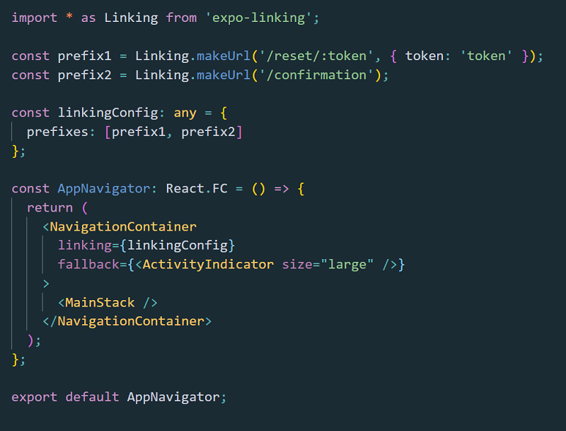
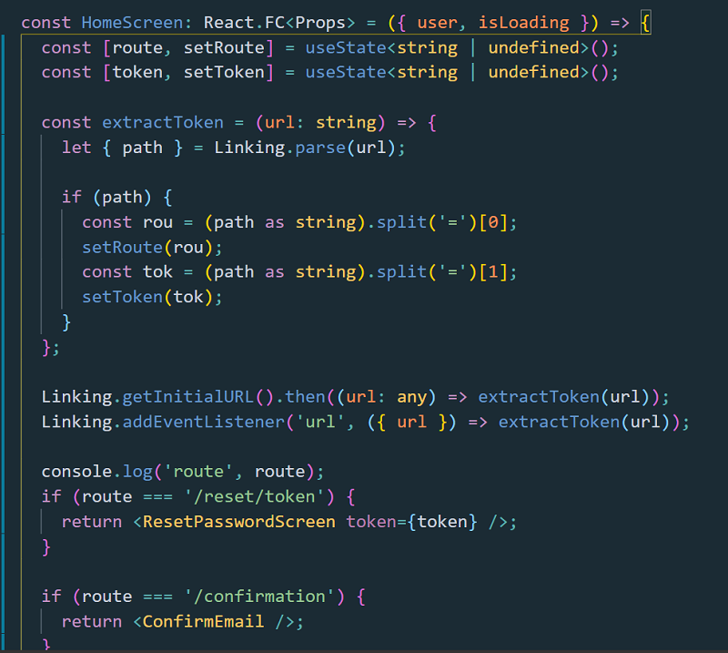

# Deep Linking Expo

I had to say it: It was not a walk in a park!

I mean, setting up deep linking for a React Native project built with Expo!

It may look like being easy, but it is not!

Why?

Well, first of all, linking from the web to a native app in Android or IOS is a bit more complex than linking from a website to another website.

The protocol changes and there are some considerations that have to be made.

It is pretty uncomfortable if you are a beginner to link to an app built with React Native CLI.

But it is even harder if the app is built with the Expo.

Simply because the app runs on Expo client and if you try to link the Expo server where your app lives, Expo may not know what to do with the link you forward!

I searched online and after many hours of reading and understanding, I just want to take you through the setup in a way that you don’t have to repeat my confusion.

I started from this article I found:

<a href=https://medium.com/javascript-in-plain-english/easy-deep-linking-with-react-native-and-expo-84e3c7b9d63e>Easy Deep Linking with React Native and Expo</a>

But there was a lot missing, which the author didn’t explain quite well.

It is something happens often to all of us: we give for granted that everyone knows what we already know because is just some initial setup, nothing complicated!

Sometimes it gets complicated!

In Expo docs you find the Linking section, where they explain well how it works!

But again, if is the first time for you, there is a chance you don’t get it!

Here we are, let’s start accepting some deep linking in our Expo app!

First thing first, you must install yarn add ‘expo-linking’.

Then in App Navigator, the Navigator that contains all the navigation logic for your app, you import Linking from expo-linking, make an URL and pass the linking to the Navigator:

 

 

That means that now, your app is able to take in incoming links from the web (or another app).
Here is what I’ve done, in a way to be able to accept more than 1 incoming link and which takes you to the right screen or component.

I made more than 1 URL, practically one for every route I had to manage inside my app.

I pass those prefixes in the array of prefixes.

Then in the Home Screen, I am listening for the incoming URL’s.

Then I parse the URL, split it in order to get the path and the query string and render conditionally a screen based on the path I received in the URL!

 

 

Very important when testing with Expo:

You may want to change to channel and copy the URL Expo gives you there. Then you want to append to that URL the route and the query params.

In my case, the testing URL looked like this:

## 
exp://pe-nf6.bogdan-dev.social-coffee.exp.direct:80/+/reset/token=’some-token-here’

Please note the '/+/' syntax after the Expo URL and your route and/or query params!

Please make sure you read the Linking section in Expo docs and you set a "scheme" in your app.json for the time your app will be a stand alone app deployed to Google Play or Apple!

As you may see, it is a piece of cake and there are roughly 20 lines of code.

But as I said at the beginning of this article, if you don’t know how to do it, the information you find googling are helping you not completely.
