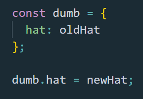
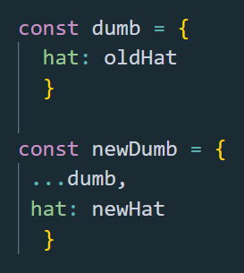

#Hello World, again!

I am doing pretty well on my path of becoming a senior Node and React developer, thank you for asking.

I am learning every day from everywhere I can, mostly from my own mistakes.

One of the biggest issues I had with React - <a href="https://bogdan.digital/redux-updates" target=_blank>after the one I had with Redux and understanding how to work with data arrived from server</a> - was to understand when and how a component will re-render!?

Of course, I know it will first render on first call!

But then?

Does it re-renders again and when?

Why would it re-render?

What in the world can determine the component to take such a radical decision?

I wrote a pretty big application, <a href="https://bogdan.digital/park-your-tir" target=_blank> Park Your Tir </a>, but I kind of wrote it badly.

It works, of course, because it was written by me, but I had no idea how to understand the render cycle and optimize it back then in prehistory.

A couple of months later, here I am to share with the entire world this life saving knowledge which will change the humanity!

Because now I am Nemo form Matrix when it comes to React, now I am the chosen one, now I know!

#A component will re-render in React in these 3 situations:

  
 <b>1. When a parent of it renders</b>

  
 <b>2. When its props changes</b>

  
 <b>3. When set state is called inside it</b>

 

#Let’s see:

The first situation, I think, is self-explanatory and does not need any other preach to be accepted.

When a component renders, all its children will render in the chain! That’s it!

You can do nothing about that!

Well, I’m joking, of course you can do something about that!

You can pray a lot!

No man, just wrap the component with use Memo hook.

It will take care to not allow re-renders, but only if the props change.

And if there is a function reference which might change also, wrap it in a use Callback!

But this is a topic in itself and I will certainly write about it next, as I have to show off my React skills and challenge Dan Abramov himself!

(Sorry Dan about that, it is just evolution!).

The third situation when a component will render again, is when you use set state.

I can tell you that for sure, because I had once an issue with a component which didn’t want to re-render and at the time I didn’t know why.

So, reading low-cost info online, someone told me to use set state and then the component will re-render as it has no other choice except going to jail!

And it did re-render, even though the state I set, I didn’t use it anywhere in that component, which leaded to another issue.

However, long story short, set state always works, it forces any component, even the most stubborn one, to re-render.

The second situation (please note how I can think now as a programmer, jumping from the first situation to the third and back to second); I was saying, the second situation is the one which interest us here in this discussion!

“A component will render when its props change!”.

Simple, is it?

Ok, you got it, au revoir!

Wait!

#Ok man, but when the props change?

Well, when you make them to change! Ask and you’ll be given!

When working with React, the props may be primitive data, such as numbers, strings or booleans.

Those never changes even if you try to buy them a coffee.

But very often props are referenced data. I mean, objects!

We all know object are passed by reference, do we? We are the best JavaScript developers in the world! I mean me and you who reads my article!

When we pass a prop as an object, React does a shallow compare between what the component receives as props and what it already has.

#
<b>prevProps === currentProps</b>

If the prevProps, the props the component already has, are the same as the props the component receives, it will not re-render!

Why would it do that? It is a shame to waste a render if nothing has change!

Let’s say the prop is a dumb with a hat.

At the first render that component printed it to the UI. If he receives the same dumb with the same hat, it won’t print it again!

This is so logic, is it?

But if it receives the same dumb with a different hat, well, teoretically then the component will get rid of the old dumb and will show the new one to the world.

Which leads us to a question:

#When the new dumb is different than the old one?

You’ll say: when you change its hat!

Yes of course, but now we are talking about JavaScript and dumbs are passed by reference.

Does not matter it has changed its hat, it is still the same dumb!

If you mutate the old dumb, you just take away its hat and give him a new hat.

Then we have mutated the dumb.

So, the const dumb is the same but only the hat has changed!

The component will re-render only if it receives a new dumb!

Giving it the old dumb, it will stay the same!

This is bad man; I can tell you that!

Not only because so you make your component to not re-render the dumb you give it again with the new hat, but because mutating the dumb you may cause some issue somewhere else, in some other part of United States, sorry, your application, which uses the dumb and needs it as it is, with its original hat!

So, the solution is to copy the old dumb to a new one and change the hat only for the new one, leaving intact the initial dumb with its original hat!

And now you pass the props to the component with the new dumb!

React makes its shallow compare and it sees there is a totally new dumb. Then it does its job and prints the new dumb to the UI.

Pretty easy, is it? Then go to vote, get rid of the old dumb! I mean the old props!
