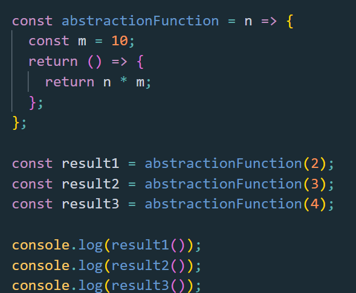
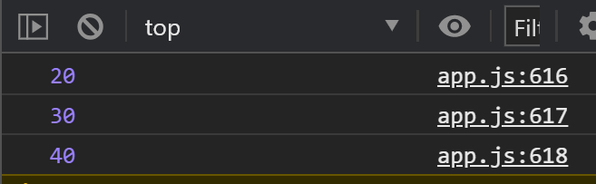

 

#Abstraction in React

I feel like I has to write about this topic.

Abstraction is such an important thing to know for a JavaScript developer.

First of all, let’s see what is abstraction, why is it important and how can it be used in React.

Abstraction is a designing software pattern which implements parts of some features in an app, hiding them away from the main code base.

Abstraction is used in order to respect the DRY principle of programming.

Why DRY (Don’t Repeat Yourself)?

For maintainability and scalability of the code you write.

It is much easier to write and maintain a piece of code once in one place and use it in many places, than writing it every time you need the same functionality in different places!

As well as for avoiding bugs.

You may fix a bug somewhere in your code, but the same code being written more than once, will produce the same bug somewhere else.

Abstraction is achieved, as far as I know, taking advantage of closures and higher order functions!

You will find fancy definitions about abstraction searching the internet, sometimes event hard to be understood with lots of unclear examples especially for a beginner.

But abstraction is nothing more than “delegating” parts of what the code does in some other parts of code written outside the main code base and using that part more than once.

In JavaScript OOP you will find the class constructor example.

You declare a “Class”, you write some methods to it and then you use those methods when you need them in your code base.

In functional JavaScript this is obtained by composing functions.

As an example, let’s see the code behind:

 

 
 

 

This is a very basic and easy to understand example about what abstraction is and what it means.

As you can see, we use closures here to pass different requests to an “abstractionFunction”.

I call them requests, even though we are not talking specifically about back-end here, to make myself understood.

As you can see, the function which “abstractionFunction” returns, is in charge with calculating the final result.

The “abstarctionFunction” is in charge with only passing a different argument to the function that it returns.

The idea behind this is that, we can wrap any function with another function just to be able to pass to the function which returns the result a dynamic argument.

We can call the “abstarctionFunction with any argument we want, any time we want from everywhere we want!

If we call the “abstarctionFunction” from inside our code base with an argument, we say we have abstracted that function which needs the result from “abstractionFunction”.

In React we do abstraction mainly with HOC’s.

But as lately everybody writes React with functional components and hooks, how the abstraction can be achieved?

In React, when talking about abstraction, the most shining example that comes to my mind is a custom hook.

A custom hook which fetches the data, let’s say.

So, from a component we can pass the URL and the verb to it and expect a result.

At the same time we can pass another URL and another verb from another component, expecting a totally different result.

const response1 = useFetch(‘url-1’, ‘POST’)
 
const response2 = useFetch(‘url-2’ ‘GET’)

We can say that we have abstract the part which takes care of dealing with the asynchronous part of the app.

Mastering abstraction is a fundamental part of being a JavaScript developer.

You won’t be able to understand it well in the very beginning, but as your developer experience grows with every line of code that you write, using abstraction will make more and more sense to you, as it did to me!
