 

#How to check if the user that signs up to your app, has introduced a real email or a fake one.

You may want to send a "check your email" out, to confirm the email address which the user introduced when it has signed up.

I’ve done that from React Native with Nodemailer in an Express app and I want to share the steps with you.

You need Nodemailer and you need your back-end app made with NodeJs. (At least for the case I am talking about here)

You find all the information about <a href="https://nodemailer.com/about" target="_blank">Nodemailer at this link</a>

Nodemailer is, as they are saying:

“A module for Node.js applications to allow easy as cake email sending. The project got started back in 2010 when there was no sane option to send email messages, today it is the solution most Node.js users turn to by default.”.

In an Express app, whenever you need to send an email, you will initiate a Nodemailer “transporter”.

Nodemailer config takes some parameters such as “email from”, “email to”, “subject”, “text” etc.

Good to know, Nodemailer won’t send the email out by itself, but it needs an email service to do it on its behalf.

Your job is to connect Nodemailer with such a service.

It can be Google Mail, Mail Gun, Sendgrid etc.

I use Sendgrid because Google Mail flags you as spam very quick and I don’t like it as it puts an email that arrives form a back-end machine as “promotions”.

Google Mail puts it in a different folder than “arriving emails”.

Anyway, I send you to Nodemailer site if you want to learn more about it.
You have the link here up.

#The topic I want to talk here is different.

I want to talk to you about asking the user to confirm its email before allowing him to use your app.

I built this in the app I am actually working on, which is made with React Native, Express and Mongo DB.

#On signup user.

When a user signs up on your app, the user data is sent to the Express app to be saved in Mongo DB.

React Native signup interface:

 

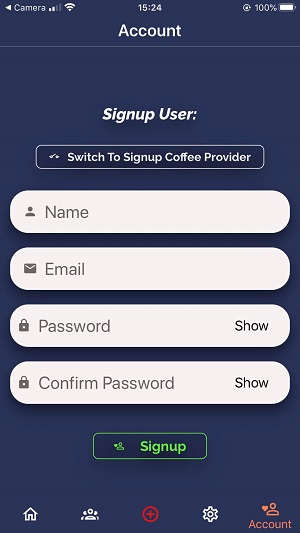

 

The app form data that is collected:
 

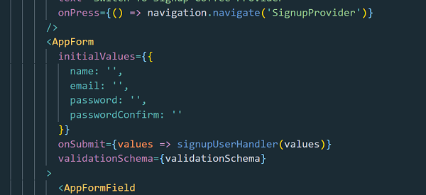

 

Make call to server Axios function:

 

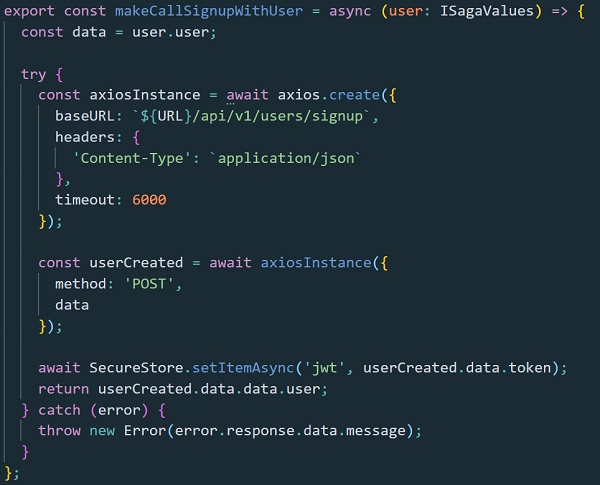

 

Then in back-end you expect the data from the front-end, coming in at the right router.

 

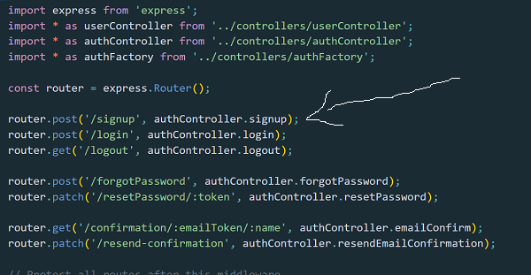

 

Further, the data is handed to the signup handler:

 

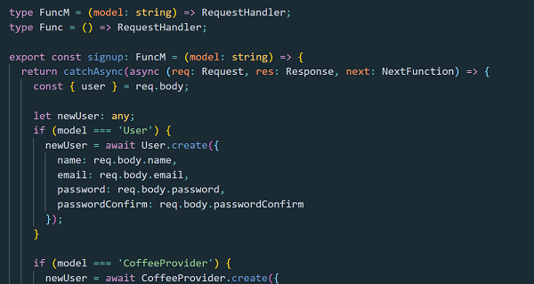

 

Here is the complete file on <a href="https://github.com/bogadrian/sca-backend/blob/master/controllers/authFactory.ts" target="_blank">GitHub</a> if you want to learn more about how I've done it.

On this handler, as you can see, after the user is signed up and its data is saved to Mongo DB, a new Email (Email with uppercase because I use a Class instantiation in oreder to send any email I want), is sent to the user email before the response is returned to the front-end.

The email contains a confirmation link.

And here is where all the magic happens.

 

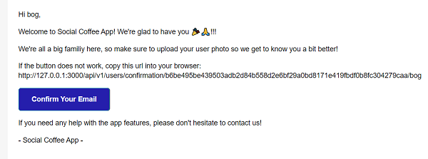

 

Nodemailer will send an email to the user email address with the confirmation link.

The link is a GET verb which, once clicked, will hit a route in the Express app.

In back-end that route will simply change a propriety from “default”, which is false, to true.

 

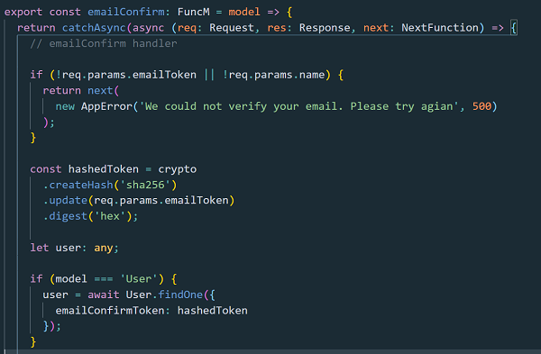

 

You can see the entire function in the Github file linked here up.

The Model Schema:

 

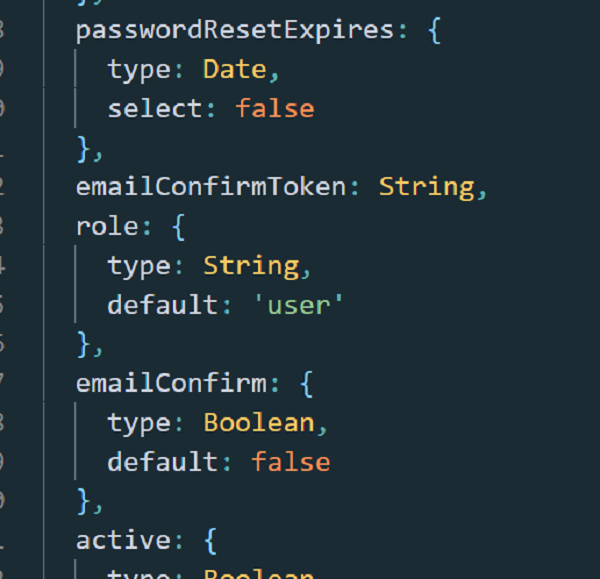

 

Of course, the link in the email is protected by a token.

The token is generated on user Schema; on the Model itself with a “pre” save hook.

When the user clicks the link in the email, the route which handle the confirmation email in the Express app expects the same token as the one was temporary saved to the Mongo DB when the confirmation email has leaved the server.

If that is the same token, the user email is confirmed, otherwise not.

The token serves to identify the user and protect that confirmation router.

So, if when the user signs up the “emailConfirm” field is false:

 

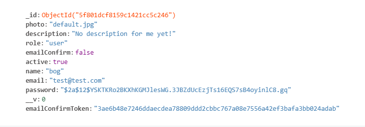

 

After the user clicks that link in the email it has received the email confirm field changes to true.

 

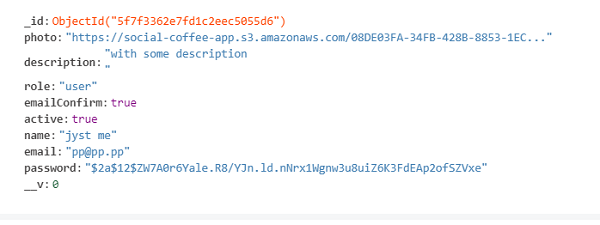

 

Now, when you fetch the user in front-end, you can first check if the user email confirm field is false or true.

If it is false, you ask the user to confirm its email.

 

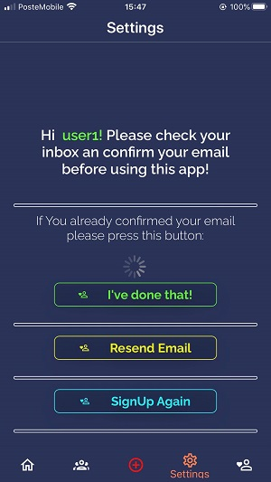

 

Checked email not done:

 

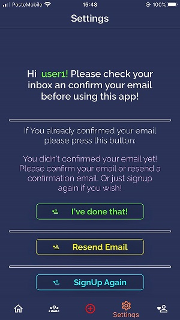

 

Checked email done, now you can use the app:

 

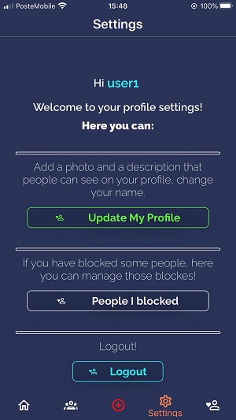

 

As you can see in the pictures above, if the user has not confirmed its email it is not allowed to use the app!

I hope this helps someone.

My GitHub is open, so you can copy all the code if you need it.
