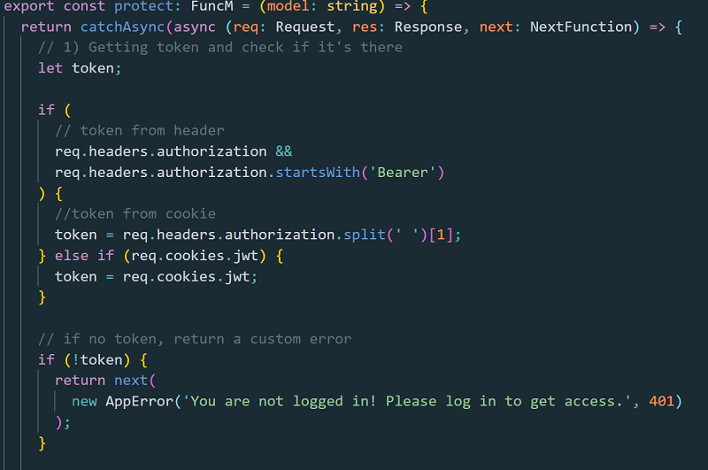
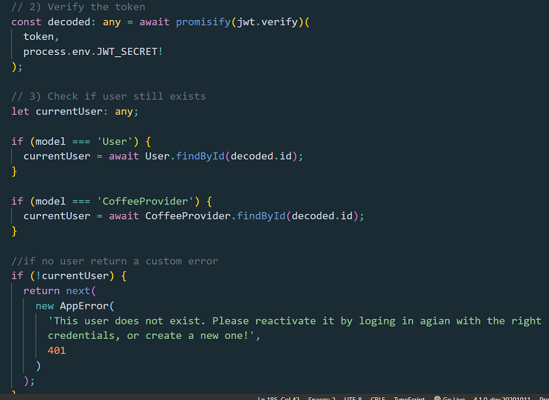
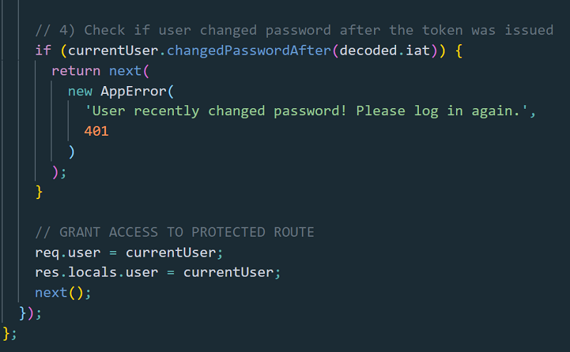
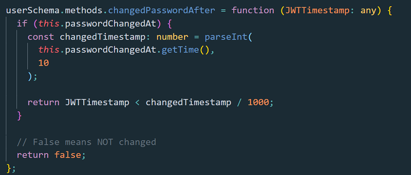

 

The anatomy of an authentication handler in Express Js.

Are you building a back-end with Express Js?

Then I am 100% sure you need an authentication handler function!

This handler will be in charge with checking the user that tries to access a protected endpoint.

It checks if that user has the right to do so.

If it does, the handler will grant the access to it.

If it doesn’t, the user will cannot access that route it tries to access!

If you are a bit familiar with Express, you probably know about the middleware.

Let me refresh your memory very quick!

You issue a request from front-end.

The request touches the Express app on the route it has been written to take!

In the image below, all the routes are under the protect middleware and can be accessed only if the user has the right to do so.

We will see how we grant that right to the user in this article.

// routes

Now the request which has come from the front-end, will go first trough “router.use(authController.protect)” as in the image here up.

The Express is made with the request object in mind.

The request object travels all the way down from where it enters the router, until a response is sent back.

All the functions it encounters between entering the route and the point where the response is sent back, are called middleware.

A middleware does only that.

It takes the request object form the precedent middleware (or from the route entering point), acts on it and pass it down to the next middleware (or just to the handler that sends back the response.

In between, a middleware can do more action on the request object.

It can modify the request object, simply by adding proprieties to it, deleting proprieties or modifying proprieties.

But, when using a protect handler middleware, that handler is in charge with doing only 1 thing: checking if the request object is allowed to pass further or not!

If it is allowed, we will call next() on that protect middleware.

Next() simply allows the request object to travel further in that chain.

If not, we return an error at every check step that happens in the handler.

There are some.

Here is something important to note!

#In order to check if a user has the right to pass down over the protect middleware, it will have to provide the request object with a token.

It is mostly a JWT token. JWT are mostly used and have become some kind of standard for doing authentication.

You can learn more about the <a href="https://www.npmjs.com/package/jsonwebtoken" target="_blank">JWT here</a>

Sounds hard?

Let see some code images!

 

 

As you can see, when the request object touches the protect middleware, the first thing we will do is to extract the JWT token.

The token can come in, either in req headers, either in req cookies.

Depends on how the frontend send it to the Express app.

We check for that in both situations, in req headers and in req cookies.

If the token exists, a variable “token” will be assigned the token value.

If the token is not there, a custom error is returned and so we force the request object traveling through the Express to the endpoint it intends to reach, to stop there!

 

 

#The next step is where the magic happens.

The JWT package, among other methods, gives us a method called “jwt verify”.
This method does one simply thing:

It takes the token that arrives in the request object and check it against a token that is GENERATED ON THE FLY.

The JWT token, as you were to JWT site and read everything there I suppose, is generated using a piece of data we give it (usually that is the user id); and a secret string we saved to our Express app. In process.env.JWT_SECRET (ex).

#I know this is a hard to understand part!

So, let’s see deep into what really happens here!

We sent a JWT token to the user when it logs in. Or on sign up if we wish.

The user returns that JWT token to the Express app, whenever it needs to access a protected route.

The jwt verify method uses the same logic and the same secret it’s used to build the token when this is first sent to the user on login.

That happens with jwt sign method. (See the jwt npm linked here above).

The jwt verify needs the token that the user provided in the request object and it needs the secret that the token was created on login with jwt sign.

The jwt verify checks the token provided by the user against a token it generates on the fly using the same secret that was used on creating the token on login user.

Then the jwt verify returns a decoded token.

We will “promisfiy” that jwt verify method because we need it to put the decoded token into a variable (using await).

In that token we have the piece of data that we used to generate the token.

It is usually the user id but it can be anything we want.

Then next, we pick that user id decoded from the token and check the database with it.
If the user exists, the id is correct, we return the user.

If the user does not exist, we return a custom error and the request object does not travel further. The app stops there!

#Are you still with me?

From here further, we may want to check if the user changed the password after it has issued the request.

 

 

By example, you forget your PC open on the desk and then the first thing you do is to change the password just to make sure no one entered the app on our behalf.

But you don’t want to allow the potential thief that stole the token to still be able to access the app.

So, you check on back-end if the password was changed.

This happens with a query hook on Model itself.

Here you have the hook:

 

 

“passwordChangedAt” is a field in the Model Schema which holds a Date.now() data when the password was changed.

If the token that the users sends in was issued before the password was changed, the hook returns true and the protect middleware stops there not allowing the request object traveling further.

If it returns false, we allow the request object to proceed as the password wasn’t changed after the token was issued.

If the request object made it so far, we will want to grant the access to the user that has issued the request by calling next() on that protect handler.

But, before doing that, we will want to put that user in the request object itself, as all the handlers which are protected by the protect middleware will need that user.

We put the user in res locals as well, maybe some handler needs it to send the response with the user at it is.

I hope you grabbed the use of a authentication handler, simply called protect middleware here.

I did my best to explain all the process.
