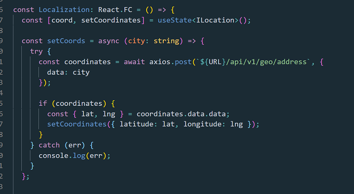

 

#Querying MongoDB for geo points, pratical guide.

Geo data is a very important part of creating web or mobile application nowadays.

1 app in 2 uses somehow geo data.

Take for example, Uber, Facebook, even Netflix.

All of them need geo data in order to work properly.

Sometimes an app needs to know where the user is located. Netflix or Facebook uses heavily this feature.

Uber or some delivery food app etc., needs to know more than that.

Them need to calculate distances between geo points, display geo points on a map to the user and so on.

I am a fan of geo data and I love working with it.

I already made full use of it in this initial app of mine, which bases all its existence on geo data: <a href="https://park-your-tir.netlify.app/" traget=_blank>Park Your Tir app.</a>

It’s a find parking app for lorry drivers.

Without maps and geo data the app would be useless.

I am building now another app, mobile with React Native, which also uses the geo data as its main feature.

It is an app which counts and display specific commercial activities on a map.

The user can see on the map the geo points where those activities are located.
(Please don't bother yourself with the UI; it is on "working progress")

 

 

I want to take you through the steps needed in order to achieve this in a MERN app using MongoDB.

#MongoDB is great when it comes to geo data.

It has inbuilt capabilities for storing geo data and querying geo data, which is optimized already.

Saving and retrieving geo data in MongoDB is really easy.

For example, I need to find places within 100, km around a given point by latitude and longitude, let’s say.

I send a query request with the latitude and longitude of the point and the radius around it to MongoDB.

A map’s markers will be shown as those geo points.

Then MongoDB responds with an array of all those geo points contained within a radius of 100 km.

In front-end I can loop over the points response and render a clickable marker for each on a map.

If you want to learn how it can be done, the first thing you must understand is that, you need to save geo points data in MongoDB first.

Let’s suppose restaurants in your city will register in the app you build.

There are 2 ways to allow them to register as geo points:

1. Let their registering device fetch their geo position.
2. Ask them to enter an address.

The first option it’s obvious I suppose.

Depends if you are working with React Js or with React Native.

For both there are libraries which allow you to ask for the user geo position.

In React Js I use “yarn add google-maps-react”. Read the library instruction <a href="https://www.npmjs.com/package/google-maps-react" target=_blank>here!</a>

In React Native I use “expo-location” just because I am using Expo for my project.

But in React Native CLI you can use <a href="https://github.com/react-native-geolocation/react-native-geolocation" target=_blank>React Native Geolocation.</a>

This apis will return back to you the latitude and the longitude of a geo point where the device fiscally is at that moment in time.

Note this: If you want to allow user to type in an address and then fetch the location from that address, you will need an external api like for example Google geocode api: "https://maps.googleapis.com/maps/api/geocode/json?address=${city}".

Once you have the latitude and longitude of the user that is registering in your app, you will want to save them to MongoDB, among other registration data.

You send the data from the front-end:

 

 

 

 

Then you receive the data in back-end on a specific route:

 

 

In the Model Schema you will have a position field which has to be of type “Point”.

This makes sure the geo point is saved to MongoDB as geo data.

MongoDB knows how to save the geo data and helps you to work with it in a very easy fashion (compare to others databases which are not that much geo optimized).

 

 

You find all the code in my <a href="https://github.com/bogadrian/social-coffee-native" target=_blank>Github Bogdan Adrian.</a>

It is free and if you need to do something similar you can copy it.

#Now you will have some restaurants users registered into your app.

Among other data them registered with, like the name, type, menu etc., there will be a geo point also saved to MongoDB restaurant document created on its registration.

The next step, easy one, is to query for the restaurants within a range that you can decide dynamically in front-end if you wish (100 km as example).

You will have to send a central position (latitude and longitude), and a radius around which you want MongoDB to respond with restaurants found.

Usually I set that radius to 100 kms around the center of the city but you can let the user to set that range.

I allow the user to change that center anyway, just by dragging the map with 2 fingers around on its mobile (or by mouse on desktop).

Every time the map position is changed, a new center is set (latitude and longitude), and a new fetch restaurant around 100 km radius is issued to the back-end.

 

 

As you can see in the image here up, I am also debouncing the request and I am waiting 500 milliseconds before I issue it to the back-end.

This is because if the user moves the map randomly and release the fingers to often, too many requests are sent to the back-end.

#So debouncing sounds like a good idea to me.

I do this with a custom hook which only job is to delay the request with 500 milliseconds.

 

 

Then in back-end, a specific end-point handler deals with this request!

 

 

#This handler uses the MongoDB “\$geoWithin” operator.

You can read about it here: <a href="https://docs.mongodb.com/manual/reference/operator/query/geoWithin" target=_blank>GeoWithin MongoDB.</a>

And this is what I was talking about when I said MongoDB is great for working with geo data!

 

 

As you can see in the picture above, I send a request with a geo point (city center etc.), and MongoDB responds with 3 results (my 3 testing restaurants that I registered – I am in developing mode now) within 100 km around that geo point!

Then, using tge <a href="https://docs.mongodb.com/manual/aggregation" target=_blank>geo aggregation</a> feature of MongoDB, you can also calculate distances between where the app user is and a given geo point on the map (a restaurant).

Lastly, you can allow the app user to open the navigator for that geo point!

It is really easy to work with geo data in a MERN app as I was saying.

I hope my explanation helps you understand how easy it is!
