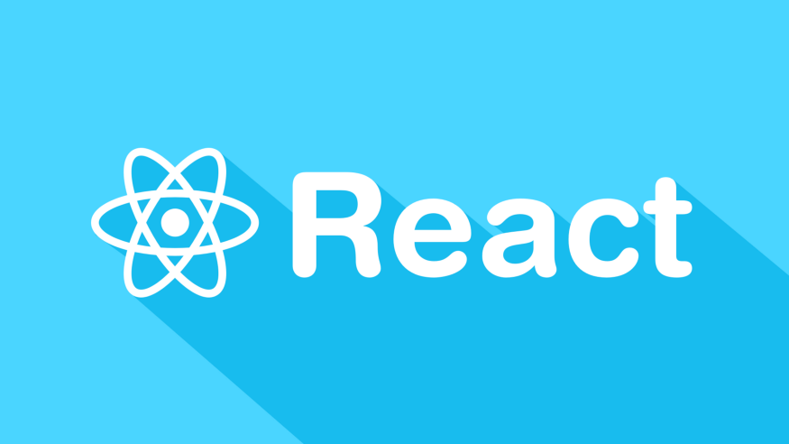

 

#Where to start from if you want to leran React?

React is the most amazing library for building User Interfaces out there!

It was conceived by Facebook and it is used by Facebook and some more huge tech companies as by example Netflix, Uber, Airbnb, even Amazon.

I learned React!

Well, I am not at the level Kent C Dodds or Dan Abramov are, but to be honest, React, day after day, has less and less secrets for me!

I remember how it was hard to grasp the use case of life cycle methods compare to “useEffect” hook.

I remember how it was hard to understand the rendering cycle in React.

I remember also how it was pretty hard to understand how optimization is applied in a React app.

Or what a design pattern really was when talking about React.

Now those days are behind me and all of these things are looking like basic knowledge, when talking about React to me!

There are many people out there who are struggling with learning React.

That’s why I want to walk you through a list of topics that you have to dive in one by one if you want to learn React.

Maybe it can be useful to someone.

Just to clear out a bit of initial confusion when starting with React!

If you want to learn React, here’s the list!

At least this is how I learned and keep on learning React myself:

#JSX, easy topic,

React is made of components.

Components are built one into another.

Just like Lego blocks.

That’s why React is so great.

You do whatever UI you want with it just like a kid is doing whatever toy it wants built from a Lego box.

Components are just JavaScript function which are then composed one into another.

Of course, I am talking here about Functional components not about Class components.

A function returns almost always something in JavaScript (except when that function interacts directly with the UI).

In React, a functional component returns always some JSX syntax.

JSX is a specific to React syntax, which interprets the HTML in JavaScript.

The component returns JSX because the virtual DOM that React uses, is composed form that JSX which the entire application is composing and returning!

You need a couple of hours to understand how JSX works!

Very easy topic!

#Class Components.

Not so much used anymore but fundamental in order to learn and understand what is going on under the hood in React.

Class Components were the way React used to work until recently when Functional components and Hooks took over.

A class component is a regular JavaScript Class OOP syntactic sugar adapted to have some React specific methods.

Them come with the life cycle methods on them.

Kind of “Will Component Mount”, “Has Component Mounted”, “Will Component Receive Props” or “Has Component Unmounted”, etc.

Then it has a render method which returnes JSX as well, just like the functional components.

It is fundamental for you to understand Class components because you need to know what the life cycle methods are under the hood.

With just hooks, you won’t be able to grasp that in an easy way!

#Functional Components

The most used nowadays. 

Them are JavaScript arrow functions which returns JSX.

They are built together with hooks.

A React app is now built exclusively with functional components, mostly, nowadays.

You need to master them if you want to be a React developer!

#Props, what and how to pass props.

Props are a fundamental part of a React app.

By props we understand a way to pass data between components, form a parent component to a child component.

We can pass any data we want with props.

Not only variables, objects or array but functions as well.

More, we can pass functions upwards, from a child component to its parent, to be executed on parent even though it is called on child!

#State and state management, fundamental topic.

State is a bit more complex than props, you need to understand that.

State is a "picture of data" took at a given moment in time.

React is a declarative UI updater.

That means, you don’t tell React what to do.

You just tell it what the data it uses is at that moment in time, and let it act upon that data.

More specific, let it act on the whenever the data changes.

So, state management is only that data management.

You manage how data is changing in React and React itself updates the UI accordingly.

#Hooks, absolutely fundamental topic.

Hooks are like inner functions to the functional components.

We can perform any kind of programming action on this inner functions.

We can modify the data (as explained here up when we talk about state management).

We can declare when and how that data change so the component will render accordingly.

We can use hooks to do anything we want inside a component and twist the code as we wish.

#Advanced hooks. Important.

Advanced hooks are pretty a theoretical aspect of using hooks.

Mainly, we refer here to the possibility of using hooks in a manner which can set conditions for the entire app, declaring the way it works.

Not only for that specific component.

It is an advanced topic and you will have to be familiar with hooks in general to dive into it.

#CSS, SASS, Styled Components etc., indispensable topic.

Any front-end application needs to be styled in order to be shown online.

It is just the way web works.

There are many ways a React app can be styled.

You will have to o learn about more than one way to style a react app.

Then choose one way to stick with.

Styled components are just CSS in JavaScript.

Some developers don’t prefer it.

I don’t prefer it.

I write my own SASS for every component in part.

I am not saying styled components are wrong.

I just don’t use them.

You will have to see how you go for styling in the apps you build and choose a way that fits you!

#React design patterns, a topic where you learn to architect a React app.

A React app needs to be architected.

You will need to draw a sketch of it and build it in an ordered fashion.

A design pattern refers to some best-known practice that allows a React app to better be conceived.

#Performance, advanced topic.

A React app needs to be performant.

Performance it’s a huge topic on itself, so learning about performance is a most, when talking about React.

The way you write React code, and here we come to the design patterns, is a direct factor which acts on performance.

So, you will have to learn to write scalable and maintainable React code.

#JavaScript.

Important to know about template literals, variable injection, closures, destructuring, higher order functions, array methods, object mutation and many more.

I drop this here to the end even though, if you are serious about learning React, I bet you already know that without knowing well JavaScript will be almost imposibile to master React.

#Good to have: understanding about functional programming.

This is something you will understand when writing React functional components.

Each of this is a fundamental part of getting to master React and huge topic in itself.

You must know that, there is much more to be learned about React than I put here down.

Every single topic I told you about in this article is then decomposable in many more subtopics you will discover when learning React.

By example, when talking about structuring a React app, you will need to learn about routing, passing params, conditional rendering, different ways to manage state etc.

But as a beginner, if you stick to this list one day you will be a React developer, I promise you.

Just like I’m now!
