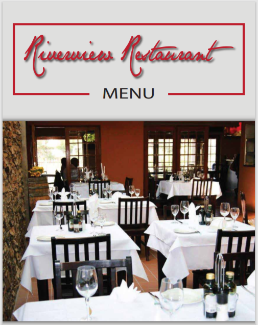

#Task: Build a feature in a React Native app, which will allow restaurants or bars to upload a pdf menu file.

Which then can be accessed at a given URL by scanning the QR code or by typing that URL in any browser!

##Status: "Accomplished"

So, how would you tackle such a task in React Native?

Well, this isn’t about React Native only! This is a full-stack application feature!

I build it so I can tell you how I made it.

I use Node Js, React Native, Express, Mongoose and Mongo DB to accomplish this!

But first, let’s see visually what I am talking about:

(Please notice the design is only a draft, so don't bother you with my design skills :) )

 

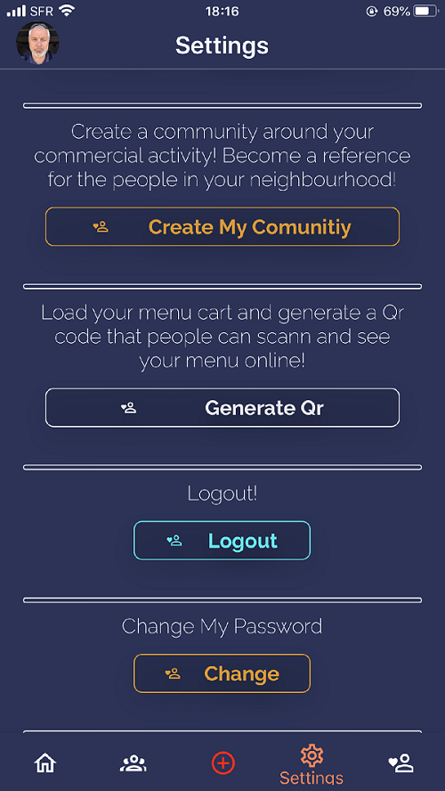

 

First step:

Assuming a restaurant who uses this app will upload a menu PDF file to it, the uploaded menu is picked up, sent in an Express Js app - as Form Data - where from is further saved to AWS S3.

Then the link to that PDF, which the S3 returns, is saved to Mongo DB.

The personalized link you see on the QR screen is generated on the fly.

 

 

The link matches the S3 PDF link in the document representing the user restaurant.

The domain, socialcoffeeapp. com, is a dedicated domain which makes a redirect to the domain where the Express app lives".

(It is not live yet, but will be when ready. The app is much more than this feature!)

So, when someone scans the QR Code (or types the link in browser), a request is sent to the Express app, which checks the database about that particular URL and returns the S3 link.

Simply, is it?

Well, if is not that simple to be honest!

So here I give you all the steps you must take to build such a feature!

Disclaimer: I use Expo with React Native in this app, so I installed Expo specific packages.

But there is no difference from React Native CLI, except for the Camera QR Scanner package.

It’s up to you which one you use, just install a package that works!

#Step 1:

Install QRCode from 'react-native-qrcode-svg'.

This package gives you a QR Code component which takes some props.

You can have a "logo" on your QR Code if you wish! See the picture up!

Another prop is “value”.

Whatever the value is, the QR generated will output that value when scanned.

That’s why it works so well for links.

Links are just strings and the QR code just gives back to the scanner that string.

You save a link to that value prop in QRCode component, and the QR Code will always open that link when scanned!

With a little difference between IOS and Android.

The IOS phone, when you open the camera photo and scan a QR code, will ask you if you want to open that link the QR represents.

But in Android is not so automatic and you need a step further:

You need a QR Code Reader component.

You’ll need to build it anyway, as you wish your app to have a feature ready for reading QR code, integrated into the app anyway.

Not relying only on browsers!

Here is the component:

 

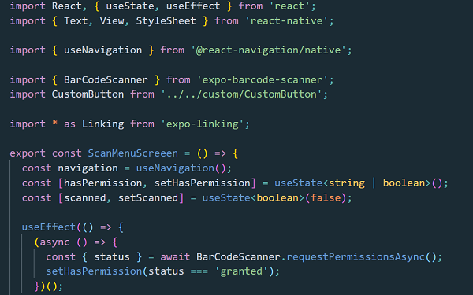

 

<a href="https://github.com/bogadrian/social-coffee-native/blob/master/src/screens/ScanMenu/ScanMenuScreen.tsx" target="_blank">Here you have the entire component in Github!</a>

If you see the URL, here is given by a custom hook that I built.

Here is the hook:

 

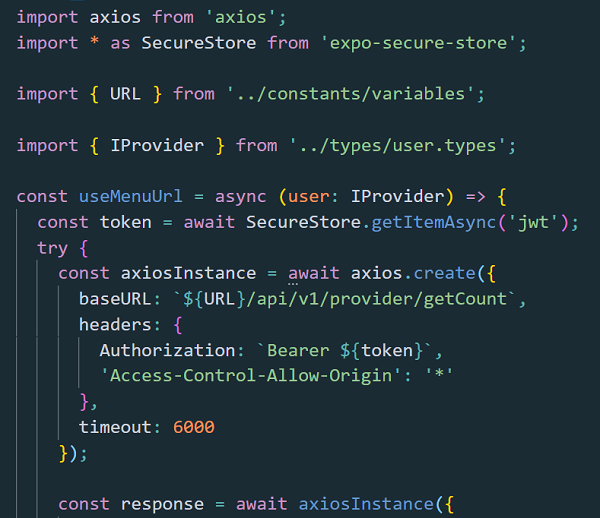

 

<a href="https://github.com/bogadrian/social-coffee-native/blob/master/src/customHooks/createMenuUrl.ts" target="_blank">Here you have the custom hook in Github!</a>

As you can see, the custom hook is in charge of creating a custom restaurant URL, end part.

I mean, the part that comes after https: //myapp. com / THIS PART HERE

How does it do that?

Well, it uses the slug from the restaurant user document in back-end, created with slugify to which it adds the count.

For example, if you are the 100’th restaurant to register to the app, your custom part of the URL will be something like this: https: //myapp. com/aswome-restaurant-100

The count part is just to avoid bugs if there are 2 or more bars with the same name.

Where "awesome-restaurant" is the slug created from the restaurant name registration: Awesome Restaurant.

Then I call an end-point on server which writes that slug thing to a field called "menuUrl".

 

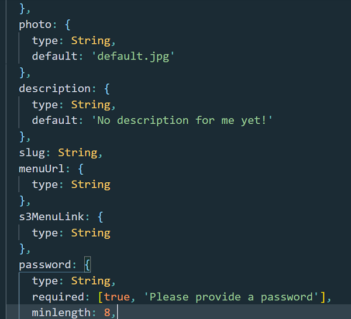

 

<a href="https://github.com/bogadrian/sca-backend/blob/master/models/coffeeProviderModel.ts" target="_blank">Here you have the entire component in Github!</a>

 

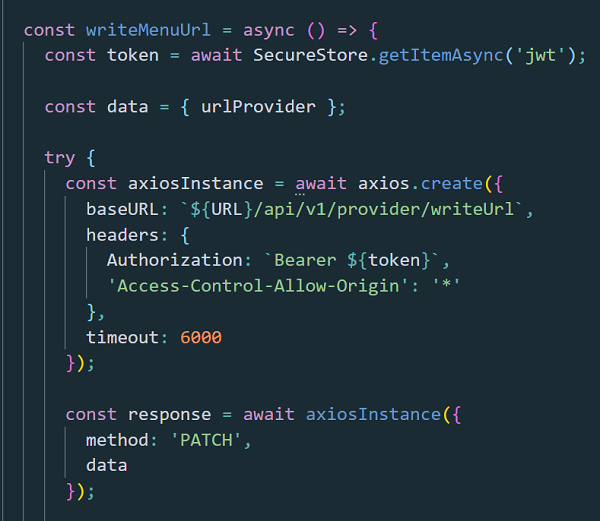

 

Are you still with me?

To generate the count, I call this simple end-point in Express app:

 

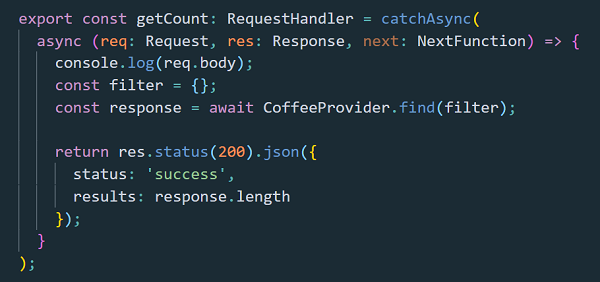

 

#Step 2

##Allow the restaurant to upload a pdf.

Here we go!

I just created a file picker component like this in image below to browse the phone and select a pdf file.

 

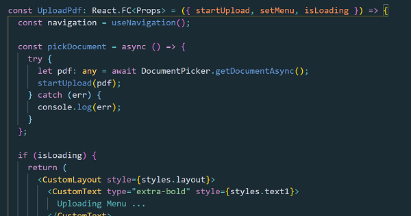

 

<a href="https://github.com/bogadrian/social-coffee-native/blob/master/src/screens/QRCode/components/UploadPdf.tsx" target="_blank">Here you have the entire component in Github!</a>

Then I call a Redux action with that pdf file.

Redux is sending the PDF to a Redux Saga function:

 

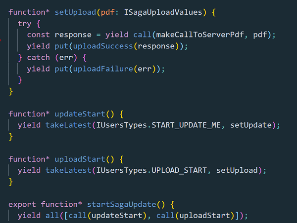

 

Then further, an API call is made to the Express app with Form Data loaded with that PDF.

 

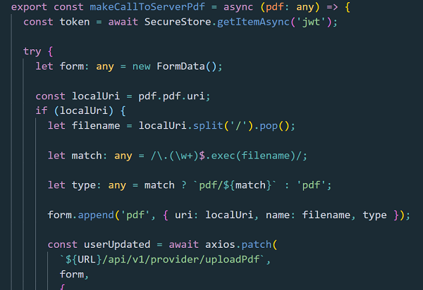

 

<a href="https://github.com/bogadrian/social-coffee-native/blob/master/src/redux/apis/updateMe.ts" target="_blank">Here you have the axios function in Github!</a>

Please note the content type is set to "application/pdf" here.

This is so important as S3 will returns that header, which allows the pdf to open in browser!

If not set to "application/pdf", a default "application/octet-stream" is set by defualt in S3 and that will only allow the PDF file to download.

I fought a bit with this thing!

I was passing the “application/pdf” to S3, but because caching it didn’t set the header.

I could not open the PDF in browser or React Native and I didn’t know what was broken at the moment!

Next, in back-end, a middleware function is called with that file:

 

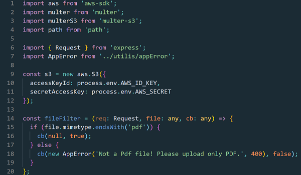

 

<a href="https://github.com/bogadrian/sca-backend/blob/master/controllers/s3Pdf.ts" target="_blank">Here you have the code to upload PDF to S3 in Github!</a>

As you can see, I filter out all the files except for pdfs.

This is simple done with an “endsWith” JavaScript function.

Note for images, I would use "startWith()", as an image will come in as "image/...".

Then I use Multer S3 package to upload the PDF to Amazon Web Server S3.

After this middleware is called, the PDF will be uploaded to S3 and it will return a link to us.

 

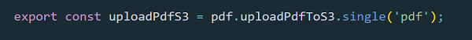

 

The link will be available in “req.file.location”.

I use that location from req object to save the link to Mongo Db in the end-point handler which comes after upload middleware.

 

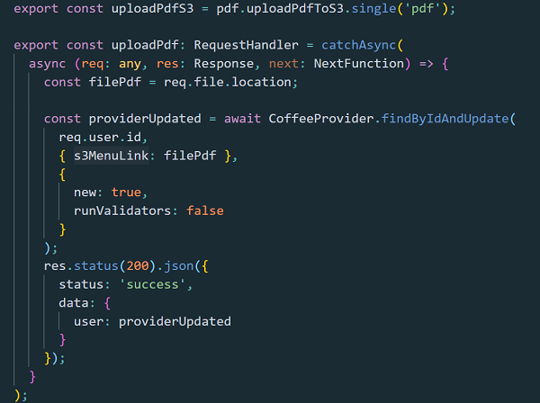

 

<a href="https://github.com/bogadrian/sca-backend/blob/master/controllers/providerController.ts" target="_blank">Here you have the entire controller in Github! Take a look at uploadPdfS3 function!</a>

This will save the link to a field in restaurant user document called S3MenuLink. (See the model image here up).

#Step 3

Are you still with me?

Now that we have the PDF link and the file is up on S3 server, the next thing we want to do is to match it with the “menuUrl” field we created earlier with our S3 link, in that restaurant user document.

But that is pretty simple and straightforward.

When we need to access a menu, either by scanning the QR code or by typing the URL, an end-point will be called on Express. Here is the end-point handler:

 

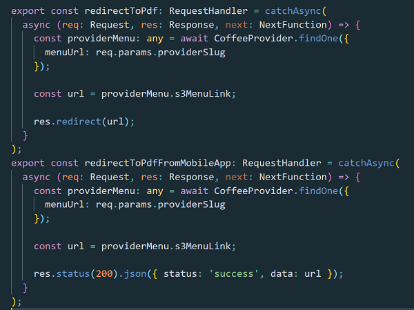

 

As you can see, we passed the name of the restaurant slug as a dynamic parameter to the redirect to pdf handler.

 

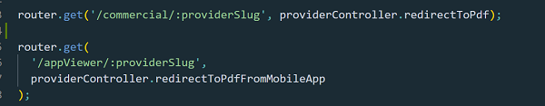

 

The handler takes that dynamic slug and searches the database for it.

Once it finds it, it will return the entire restaurant user document.

In that document we have of course that s3MenuLink field which contains the link to the S3 PDF.

Then we use “res.redirect” to that URL and that allows us to have the PDF file open from everywhere, in every browser!

Or maybe we may want to give the user a chance to open it in our app so we create a second redirect to PDF end-point handler which returns a json response this time and the data is sent to client with that S3 link field.

Then we use that response in our React Native app in a component called ViewMenuScreen.

Here I use another package to render the PDF, called PDFReader . Imported from 'rn-pdf-reader-js'

 

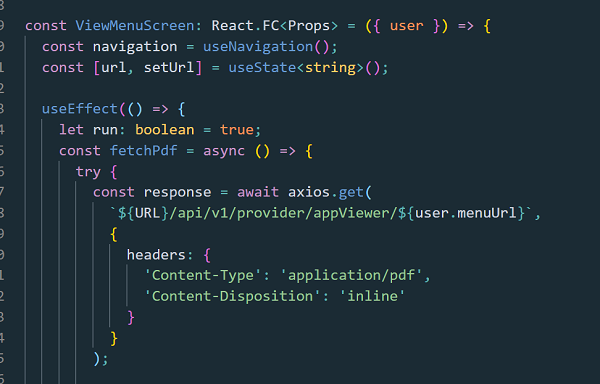

 

<a href="https://github.com/bogadrian/social-coffee-native/blob/master/src/screens/ViewMenu/ViewMenuScreen.tsx" target="_blank">Here you have the entire component in Github!</a>

So, now we have a mobile app where the restaurant owners can upload a PDF menu file and their clients can scan a QR code to see that menu.

 

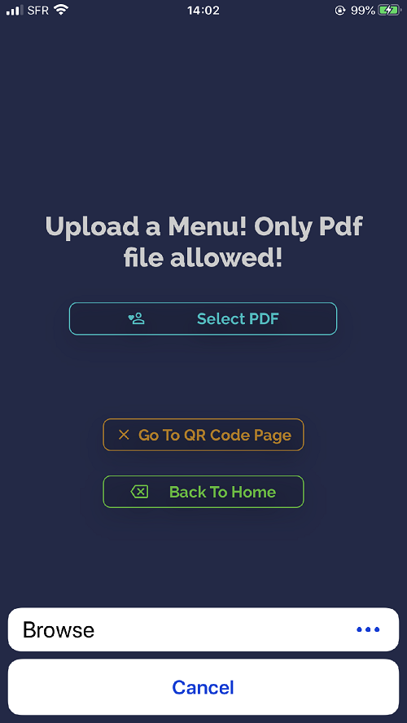

 

Or their clients can type the URL we give them in browsers!

The restaurants are supposed to stamp that QR code, and the link, and display them on the tables, visit cards, share them on Facebook etc!

Well, that is a lot of work and thinking it takes to fit all of this together in a bigger picture.

I spent 3 days to build this, but half of that time I spent only with the suppose S3 bug which only allows to download PDF files but not to show them on line!

If you ever need something like this, here you have it!

This article and the Github repo which is open!

Thanks for being with me so long! Hope I could help!
