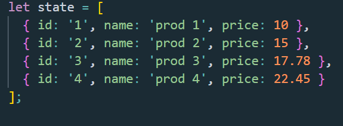
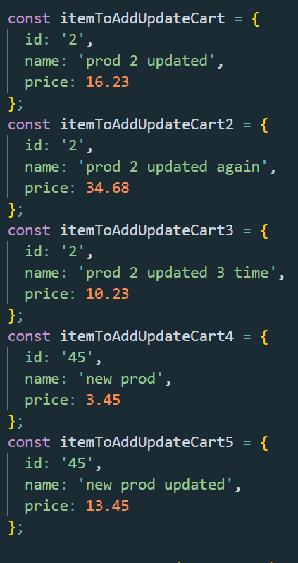
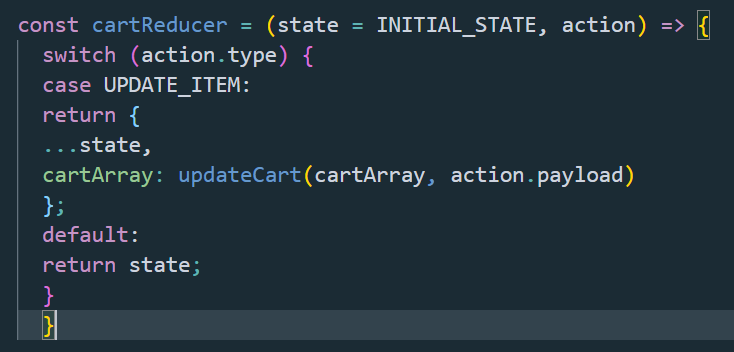
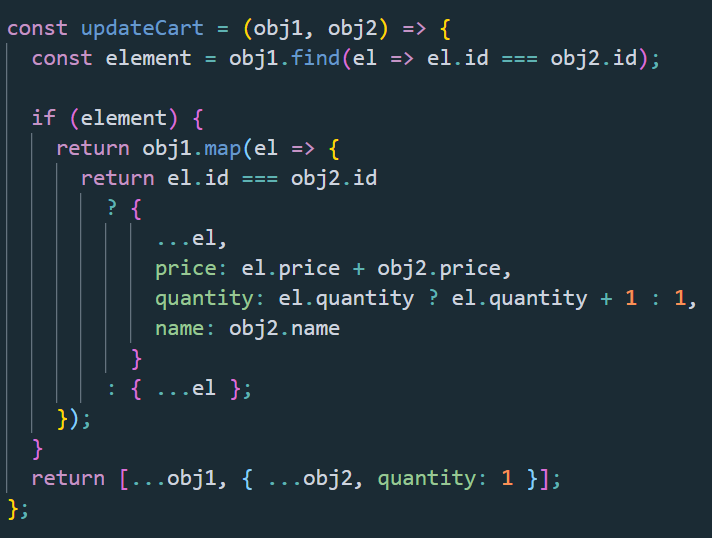
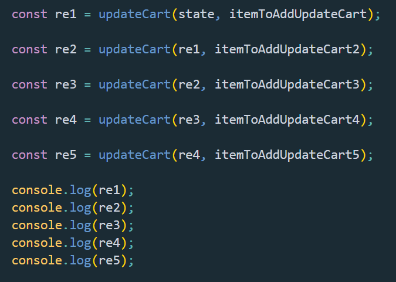
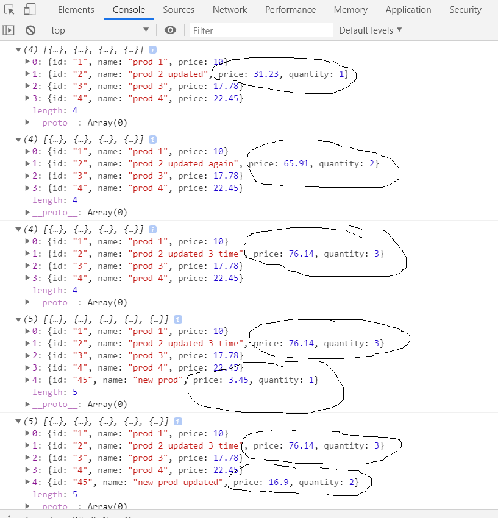

 

 

#
How do we update the state with Redux on action update?

One of the most technical problem beginner developers face when working with Redux store in React, is how and when to update the store on actions, like for example item update.

I faced this problem and as updating the reducer has nothing to do with React or Redux itself, but only with Vanilla JavaScript, I want to say how I learned to solve this kind of problem.

The most obvious example would be, I believe, an e-commerce cart update!

Let’s imagine we have some kind of e-commerce app made with React where we use Redux for our internal state management.

We fetch products from a back-end and display them on the front-end, filtering them in many ways.

By example, by category, or maybe by user interests, or maybe by regional availability etc.

We dispatch our fetch products action to the action function in the component in charge with doing that.

The action function then acts on that dispatch and may take advantage of some fetching middleware such as Redux Thunk or Saga.

(The middlewares in case we do not start the fetch in a useEffect in the component itself, but I suppose not because this would be an e-commerce app and not an educational Todo app).

After the fetch response returns, the action forwards the answer to the reducer.

The reducer must now take notice of that response and it is in charge with modifying the store to acknowledge the change brought by that action fetch.

Well, all this “unidirectional” flow is pretty obvious to who works with React and Redux after he/she passes trough an initial tutorial.

And to be honest, it is easy to learn as well! The data goes only one direction!

There is not much to do apart from taking care of having the Store and the Provider well configured, dispatching the right action from the right component at the right time! Is it?

Or, maybe not?

Let’s see!

When we first start the app and we did our first fetch for the products, the flux is that explain up here and the reducer must do nothing more than to allocate the action payload to the initial state.

But what when we need to update an item in that initial state products array?

By example, we take the item product from the products array and add it to a cart array somewhere in another reducer in charge with the cart?

Or just, as administrator of that e-commerce, we need to update the price of one of the products already fetched?

Are we going to dispatch an action to fetch that change in back-end, wait for the answer to come back and then fetch again all that products array (which now contains the changes made to that particular item)?

Well, we can do that! It works just fine!

But it has something to do with optimization!

A new general fetch of all the products array with all the tree components re-render down side?

Beah, I would say not!

It is a bad pattern! Beginners are doing this kind of things always!

Just because it works! I did that!

But I kept on wondering if it is ok to do that?!

In practice, all you have to do is to fetch every single time there is a change to that array product and just dispatch the action payload with the new array - just arrived from back-end - to the reducer!

Simply that way, is it?

So, let’s see now how we would update the store without fetching again all the products array.

First of all, when we are updating an item in a product array, we are anyway dispatching an update action to the back-end.

Consequently, there will be an answer.

It can be a success fetch answer or a failure update answer.

In both cases, we want to update the store.

Let’s first write a mocked-up data product array (let’s suppose it has been fetched form back-end).

In this particular case I exemplify here, the mocked-up array is supposed to be an array of products added to a cart by the user.

The products in the array were pushed there by the user selection action.

Up here we have a mocked-up cart, an initial state array which contains 4 products already added.

Now, the user wants to add a new product to the cart.

We need to add the item to the state array if there is not a product with that id or increase the quantity, update the price and eventually modify the name if the product is in array already and new product with that id is added!

Here we have 5 action mocked-up.

3 of them are updating an item (product) which happens to have the same id.

However, the item's id that the user adds to the cart exists already in the cart array.

##
Now we simulate the reducer:

The reducer as we can see, makes appeal to an utility function which is in charge to loop trough the cart array, find if there is already the item id and then update the item price, quantity and name.

Or just to add the item to the cart array if there is not such an item id!

##
And then we simulate the actions dispatch:

If now we simulate 5 actions dispatch calls with those 5 items that must be added to the cart array, from which 3 of them have the same id and that id already exists in the cart array initial state, meanwhile 2 of them are a new id added for 2 times (please note the price changes every single time just to simulate some kind of discounts whatsoever, the name changes either in order to simulate a new name for the same product and knowledge a change that has happened as the discount applied etc), we will see something like this:

Conclusion: Working with Redux is a very nice thing for a web developer! I can tell you that from my own point of view!

There are some patterns which we have to follow in order to make sure that the apps we build are working as smooth and as good as any app out there made by much bigger developers than us, or company!

And the fact is that, we don’t need to invent the wheel again, we just need to open our eyes and watch what developers before us have done in so many years of research and implementation!

Happy Redux everyone!
