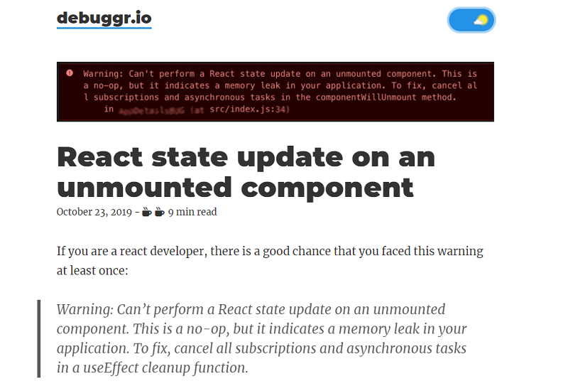

 

 

#Hi Reactish people, comment cà va?

React is wonderful, is it? It allows us to build beautiful, but most importantly, fully functional client-side interfaces!

I dived deep into React world in the last year or so and I started finnaly to grasp those tricks that allow me to use the framework without expecting surprises, anymore!

But I remember when I first started with React!

I knew JavaScript but I wasn’t a “guru” to it, to be honest!

When learning React, I improved a lot my JavaScript knowledge, simply because React is JavaScript at the end of the day!

And JavaScript core principles are needed if I want to be a decent React developer!

Well, let me tell you about one of the first error I encountered when I built applications with React:

“Warning: Can’t perform a React state update on an unmounted component. This is a no-op, but it indicates a memory leak in your application.

To fix, cancel all subscriptions and asynchronous tasks in a useEffect cleanup function.”

It looked so strange to me back then!

You have to know it: This is “the most reactish error” out there that may happen to you!
All the React world lies under what this error theoretically saying!

Now, I laugh at me when I see this error. But in the beginning, it wasn’t like that!

Let’s see why!?

Well, if you see this error and you don’t know what is is about, the first thing you do is search Google for it, is it?

In the first results this article comes up:

##
<a href="https://www.debuggr.io/react-update-unmounted-component/" target="_blank">React state update on an unmounted component</a>

Yes, it is a complete article and it resolves your problem, no doubt about it!

But let me tell you something: It is too technical for a beginner!

As a beginner, you probably will stare to those lines of codes and won’t understand too much of it, is it?

Fact: if you are able to understand what is all about in this article, my bet is you won’t need to read the article!

So, let’s take a drive through this error and dissect it piece by piece!

What means exactly this error?

Well, it says this:

“You can’t move away from a component to another component into your app and try to set the state in the component you just left, if some operation is still going on in it and the component is still there (is unmounted)”.

Let’s be very clear: A operation that is still going on is an asynchronous operation, almost all the times!

An operation that is still pending waiting for an answer (resolve or reject) to come back from somewhere!

Now the second part: when a component is mounted and when it is unmounted?
In Facebook React docs you can read this:

“When tearing down a tree, old DOM nodes are destroyed. Component instances receive componentWillUnmount(). When building up a new tree, new DOM nodes are inserted into the DOM. Component instances receive componentWillMount() and then componentDidMount(). Any state associated with the old tree is lost.”.

Let me be clear as a beginner needs me to be in order to understand this:

If you move away from a component without triggering a refresh or without changing the props that the component receives, the component will stay mounted even though you have moved away to another component!

Do you get it?

It is exactly this particular situation when the “most reactish error” out there appears!

Well, it does not always appear, but only if you ARE TRYING TO DO SOMETHING in the component that you moved away from, as for example set the state!

Do you get it now?

Simply: Don’t do anything in a component if you are not in it anymore (you moved away) – you don’t see it on the screen – but it is still there, mounted on the DOM!

The error tells us that we should “unsubscribe” from whatever we are doing in that component!

Usually, the async operations happens in an useEffect hook, but this does not matter!

To clean whatever we are doing asynchronously in that component and let it die in peace, we “must” tell to that asynchronous operation to stop, no matter if it is still pending!

How can we do this?

Well, the article cited above explain it is a good way!

Just to resume: Sometimes an unsubscribe function is available to us by the asynchronous code we run, as for example a Firebase auth operation!

Some other times is up to us to create a Boolean, first declared as true when the async operation starts, then clean it up in an useEffect hook cleaning return function by setting it to false, so the async operation is stopped!

I hope this explanation helps someone as I wish something like this would have helped me in the beginning of my reactish journey!
